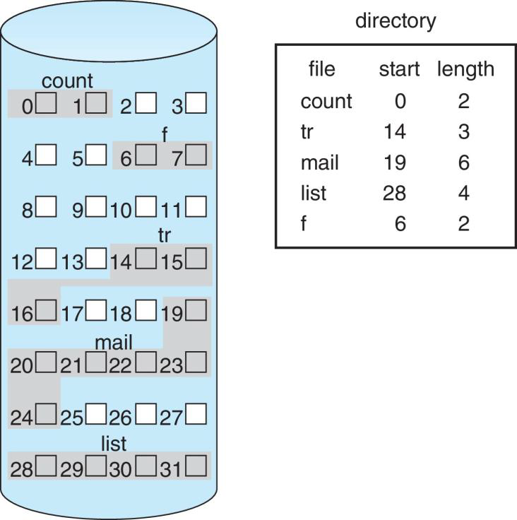
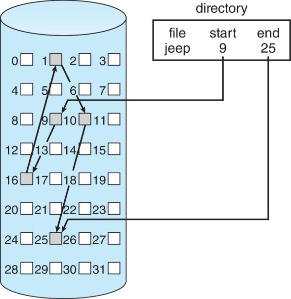
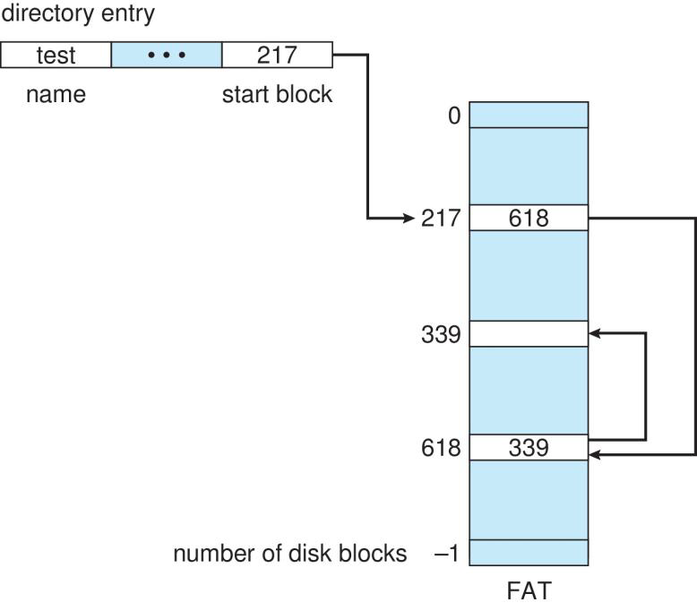
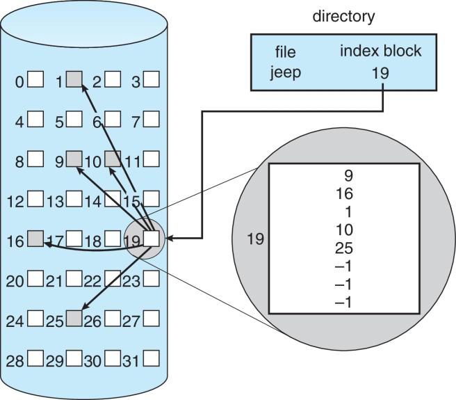
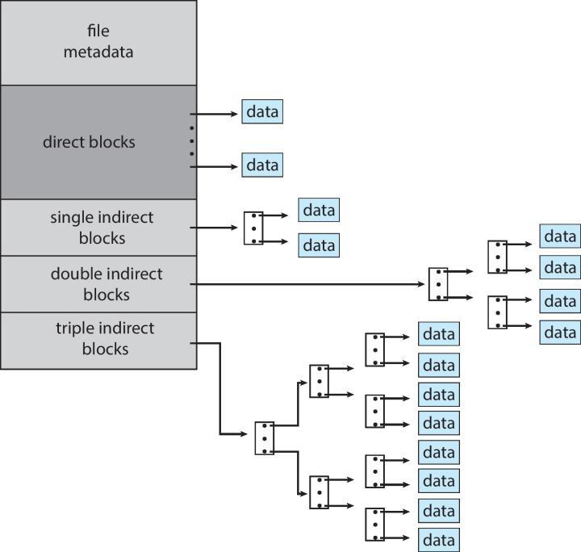

# File System Implementation Lecture Notes
## 1DV512 Operating Systems - Lecture 11


## Overview

### Key Concepts
- File systems usually reside permanently on secondary storage
- General-purpose OS provides multiple file systems:
  - Disk-based (permanent storage)
  - Temporary file systems (fast, non-persistent)
  - Different trade-offs: ext4 (Linux) → +reliability, −performance

### Main Topics Covered
- Storage space allocation methods
- Free space recovery and tracking
- Data location tracking


## File System Structure

### Disk Characteristics

**Key Properties:**
1. **Rewritable in place** - read, modify, write same block
   - NVM (Non-Volatile Memory) devices cannot be directly rewritten
2. **Direct access** - can access any block of information directly
3. **Block-based I/O** - transfers in units of 512-4096 bytes per block

### Design Problems
1. Define how file system appears to user
2. Create algorithms and data structures to map logical file system to physical storage


## Layered File System Structure

### Layer 1: I/O Control
- Device drivers and interrupt handlers
- Example: "retrieve block 123"

### Layer 2: Basic File System (Block I/O Subsystem)
- Issues commands based on **logical block addresses**
- Schedules I/O requests
- Manages memory buffers and caches

### Layer 3: File-Organization Module
- Knows about files and their logical blocks
- Manages free space
- Translates logical blocks to physical blocks

### Layer 4: Logical File System
- Manages **metadata information**
- Manages directory structure
- Provides file-organization module with information based on filename
- Maintains file structure via **File Control Blocks (FCB)**
  - Called **inode** in UNIX
  - Contains: owner, permissions, location of file contents


## File Control Block (FCB)

### Contents
- File permissions
- File dates (create, access, write)
- File owner, group
- File size
- File data blocks or pointers to file data blocks

### File Creation Process
1. Logical file system allocates new FCB (or gets one from free FCB list)
2. System reads directory into memory
3. Updates directory with new filename and FCB
4. Writes updated directory back to file system


## File System Types

### Common File Systems

**UNIX:**
- UNIX File System (UFS)

**Windows:**
- FAT, FAT32, NTFS
- Also supports CD-ROM, DVD

**Linux:**
- 130+ file systems supported
- Standard: Extended File System (ext3, ext4)

**Other:**
- Google created custom file systems for specific needs
- CD-ROM uses ISO 9660 format

### Advantage of Layered Structure
- I/O control code can be reused by multiple file systems
- Sometimes basic file system can also be reused
- Each file system has its own file-organization module and logical file system


## File System Operations

### On-Storage Structures
On storage, the file system may contain information about:
- How to boot an operating system stored there
- The total number of blocks
- The number and location of free blocks
- The directory structure
- The individual files

**Boot Control Block (per volume):**
- Information needed to boot OS from that volume
- Typically first block of volume
- Empty if volume doesn't contain OS

**Volume Control Block:**
- Number of blocks
- Size of blocks
- Free-block count
- Free FCB count
- FCB pointers
- Called **superblock** in UFS
- Called **master file table** in NTFS

**Directory Structure:**
- Organizes files
- In UFS: file names + associated inode numbers

**Per-file FCB:**
- Unique identifier number for each file


## In-Memory File System Structures

Loaded at mount time, updated during operations, discarded at dismount:

### 1. Mount Table
- Information about each mounted volume

### 2. Directory-Structure Cache
- Information of recently accessed directories

### 3. System-Wide Open-File Table
- Copy of FCB of each open file
- Number of openings of each file
- **Many processes can have a file opened simultaneously**

### 4. Per-Process Open-File Table
- Pointer to appropriate entry in system-wide table
- Current file pointer
- Access mode

### 5. Buffers
- For blocks being read/written


## File I/O Operations

### open() System Call

**Process:**
1. Receives filename from user
2. Logical file system searches system-wide open-file table
   - **If already open:** Create per-process entry pointing to existing system-wide entry
   - **If not open:** Search directory for FCB using filename
3. Returns file descriptor (pointer to per-process table entry)

### close() System Call

**Process:**
1. Removes entry in per-process table
2. Decrements counter in system-wide table
3. **If counter reaches 0:**
   - Copy metadata to disk
   - Remove entry from system-wide table

### Demo Experiment (Linux)
```bash
# Create file, symbolic link, open both with 'more'
# Check PID of both more processes
# ls -l /proc/PID/fd of both
# What happens? Compare with hard link
```


## Directory Implementation

### 1. Linear List

**Implementation:**
- Simplest approach
- List of filenames with pointers to data blocks

**Performance:**
- **File creation:** Search for duplicate name, add to end - O(n)
- **File deletion:** Search by name, release space - O(n)

**Reusing freed entries:**
- Mark entry as unused
- Attach to list of free directory entries
- Move last entry into freed location (if not sorted)

**Optimization - Sorted List:**
- **Advantage:** Faster search
- **Disadvantage:** Complicated insert/delete


### 2. Hash Table

**Implementation:**
- Linear list stores actual entries
- Hash table indexed by hash of filename
- Returns pointer to file entry in linear list

**Advantages:**
- Faster lookup than linear list

**Difficulties:**
- **Resize:** Must recompute hash values when table gets full
- **Collisions:** Use linked list in each hash bucket

## Allocation Methods

Goal: Allocate space to multiple files on same device such that:
1. Storage space utilized effectively
2. Files can be accessed quickly

## 1. Contiguous Allocation


### Concept
- Each file occupies set of contiguous blocks
- File defined by: starting block address + length

### Advantages
- **Simple:** Block j of file starts at address b+j
- **Good for disks:** Reading block b+1 after b usually needs no head movement
- **Fast access:** Both sequential and direct access efficient

### Disadvantages

**1. External Fragmentation**
- Solution: Periodically copy file system to another device, then copy back
- Compacts free space into one contiguous area
- **Very SLOW!**

**2. Finding Space for New File**
- Same problem as dynamic storage allocation in memory
- Need best-fit, first-fit, worst-fit algorithms

**3. Determining File Size**
- How to know final size in advance?
- Pre-allocation inefficient if file grows slowly over time

### Optimization: Extent-Based
- Use chunks (extents) of contiguous space
- Allocate one extent initially
- Add more extents if file grows
- **File location info:** block location, block count, link to next extent
- **Trade-off:** Internal fragmentation with large extents


## 2. Linked Allocation


### Concept
- Each file is linked list of storage blocks
- Directory contains pointer to first and last blocks
- Each block contains pointer to next block (last is null)

### File Creation Steps
1. Create directory entry
2. Initialize first block pointer to null
3. Set size to 0

### Writing to File Steps
1. Free space management finds free block
2. Block is written
3. Block linked to end of file

### Advantages
- **No external fragmentation**
- **Easy to grow files**

### Disadvantages

**1. No Efficient Direct Access**
- To find block j, must start at beginning and follow j pointers
- Only suitable for sequential access

**2. Pointer Space Overhead**
- 4 bytes out of 512-byte block = 0.78% wasted
- **Solution:** Use clusters of blocks instead of single blocks
  - **Trade-off:** Introduces internal fragmentation

**3. Reliability Issues**
- If pointer is damaged, rest of file is lost
- **Possible solution:** Double linked list


### Variation: File Allocation Table (FAT)

**Used in MS-DOS**

**Structure:**
- Table at beginning of volume
- One entry per block on disk
- Each entry contains:
  - Index of next block (if part of file)
  - Special end-of-file value (if last block)
  - 0 (if unused block)


**Operation:**
- Directory entry contains first block number
- Follow chain through FAT to access file blocks
- **Allocating block:** Find first entry with value 0

**Advantage:**
- Centralized block chain information
- Easier to manage than distributed pointers


## 3. Indexed Allocation


### Concept
- Brings all pointers together into **index block**
- Each file has its own index block (array of block addresses)
- j-th entry in index block points to j-th block of file
- On creation, all entries point to null

### Advantages
- **Supports direct access** - can calculate position of any block
- **No external fragmentation**

### Disadvantages
- **Pointer overhead** of index block
- **Index block sizing problem:**
  - Want small index block (one per file)
  - Want large files (need large index block)


## Solving Index Block Size Problem

### 1. Linked Scheme
- Index block size = one storage block
- Last pointer in block points to another index block
- Or null if last index block

### 2. Multilevel Index
- First-level index blocks point to second-level index blocks
- Can add more levels as needed
- Similar to hierarchical paging in memory management
- **Example:** 4KB blocks, 4B pointers → 2 levels allow 1M blocks (4GB file)

### 3. Combined Scheme (UNIX-based)

**Structure in inode (15 pointers example):**
- **Pointers 0-11 (12 direct blocks):** Point directly to data blocks
- **Pointer 12 (single indirect):** Points to block containing data block pointers
- **Pointer 13 (double indirect):** Points to block containing pointers to blocks containing pointers
- **Pointer 14 (triple indirect):** Three levels of indirection



**Advantages:**
- Small files use only direct pointers (fast)
- Large files can grow using indirect blocks
- Very large files use double/triple indirect

**Calculation Example:**
- Block size: 4KB, Pointer size: 4B
- Pointers per block: 4096 ÷ 4 = 1024
- **Calculating Data Block Ranges**
- Direct blocks (pointers 0-11):
    - Data blocks 0-11 (12 blocks total)

- Single indirect (pointer 12):
    - 1 index block containing 1024 pointers
    - Data blocks 12 to (12 + 1024 - 1) = blocks 12-1035

- Double indirect (pointer 13):
    - 1 index block → 1024 index blocks → 1024 × 1024 pointers
    - Data blocks 1036 to (1036 + 1024² - 1) = blocks 1036-1,049,611

- Triple indirect (pointer 14):
    - 1 index block → 1024 index blocks → 1024² index blocks → 1024³ pointers
    - Data blocks starting from 1,049,612 onwards


## Performance Comparison

### Contiguous Allocation
- **Best performance:** Only 1 access to get any block
- Works for both sequential and direct access

### Linked Allocation
- **Good for sequential access**
- **Poor for direct access:** j-th block may require j block reads
- Not used for direct access

### Indexed Allocation
- **Direct access:** Read index block + read data block (2 accesses minimum)
- **Multi-level index:** Multiple index reads before data access
- **Large files with linked indices:** Many index reads for blocks near end

### Hybrid Approaches

**Some systems:**
- Contiguous allocation for direct access files
- Linked allocation for sequential access files
- Declare type at file creation

**Some systems:**
- Contiguous allocation for small files
- Automatically switch to indexed if file grows

### Performance Note
CPU-disk speed disparity means investing many extra instructions to save a single disk head movement is worthwhile.


## Free-Space Management

### Goal
- Reuse space from deleted files (when possible)
- Some media don't allow reuse (e.g., write-once optical disks)
- Maintain **free-space list** to track available disk space

### When Creating File
Search free-space list for required space.


## Free-Space List Implementations

### 1. Bit Vector (Bitmap)

**Structure:**
- Each block represented by 1 bit
- Bit = 1 → block is free
- Bit = 0 → block is used

**Example:**
```
001111001100000011010111...
```
Shows blocks 2,3,4,5,8,9... are free

**Advantages:**
- Simple
- Easy to find contiguous space

**Disadvantages:**
- Inefficient unless entire vector kept in main memory
- **Size example:** 1TB disk with 4KB blocks
  - Needs 2^40 ÷ 2^12 = 2^28 bits = 2^25 bytes = 32 MB


### 2. Linked List

**Structure:**
- Link free blocks together
- Keep pointer to first free block in special file system location
- Each free block contains pointer to next free block

**Advantages:**
- No need to keep large data structure in memory
- Efficient use of space

**Disadvantages:**
- Cannot easily find contiguous space
- Not efficient to traverse (but traversal is rare)

**FAT Integration:**
- FAT method incorporates free-block accounting into allocation data structure
- No separate free-space list needed


### 3. Grouping

**Structure:**
- Modification of free-list approach
- First free block stores addresses of n free blocks
- First n-1 addresses are actually free blocks
- n-th address points to another block containing n more addresses

**Advantage:**
- Finding large number of free blocks becomes faster
- Can quickly skip through groups


### 4. Counting

**Concept:**
- Uses fact that contiguous blocks often allocated/released together
- Each entry contains:
  - Address of first free block
  - Count of contiguous free blocks

**Advantage:**
- Compact representation when free space is contiguous
- Efficient for systems that allocate in clusters


## Key Takeaways

### Allocation Methods Summary

| Method | Direct Access | External Frag | Pointer Overhead | Best For |
|--------|--------------|---------------|------------------|----------|
| Contiguous | Excellent | Yes | None | Random access, small files |
| Linked | Poor | No | High | Sequential access only |
| Indexed | Good | No | Medium | Mixed access patterns |
| Combined | Good | No | Low for small | All file sizes |

### File System Layers
1. **I/O Control** - lowest level, device drivers
2. **Basic File System** - logical blocks, caching
3. **File Organization** - manages free space
4. **Logical File System** - metadata, directories

### Important Structures
- **FCB/inode** - per-file metadata
- **System-wide table** - all open files (shared)
- **Per-process table** - each process's open files

### Free Space Management
- **Bitmap** - simple but memory-intensive
- **Linked list** - space-efficient but slow for contiguous allocation
- **Grouping** - faster for large allocations
- **Counting** - efficient when space is contiguous


## Important Concepts

- **Superblock** (UFS) / **Master File Table** (NTFS) - volume control block
- **Direct blocks** - immediate data access
- **Indirect blocks** - pointer to pointers (1-3 levels)
- **Extent** - contiguous chunk of blocks
- **ISO 9660** - CD-ROM file system format

