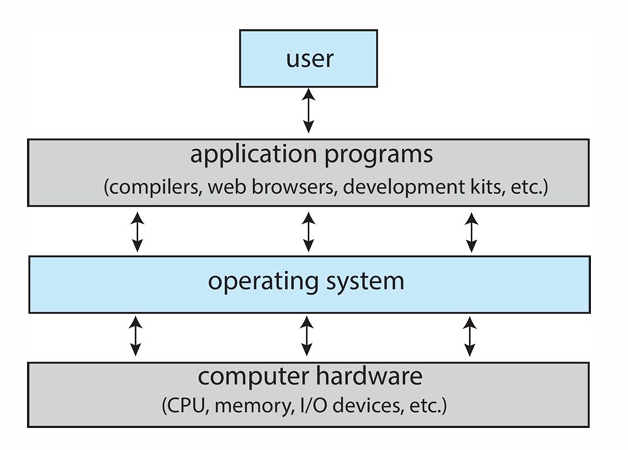
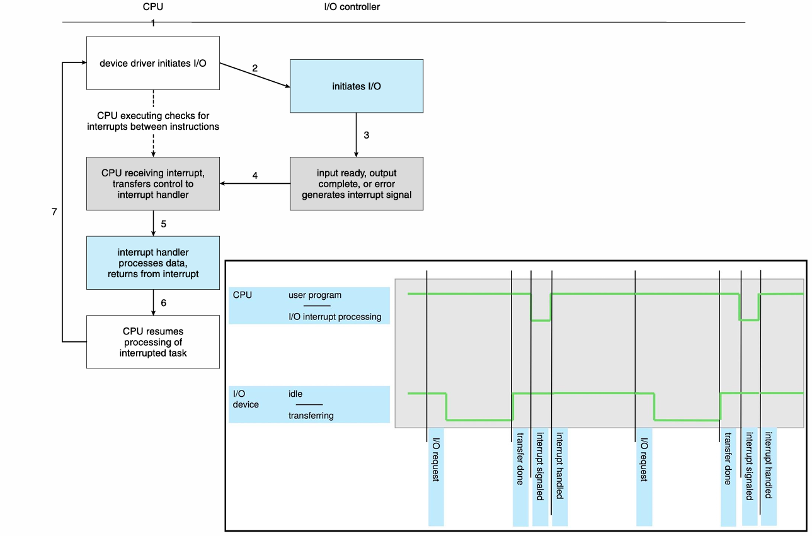
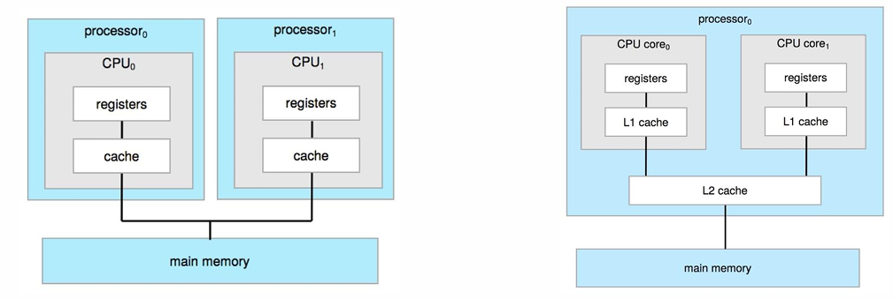
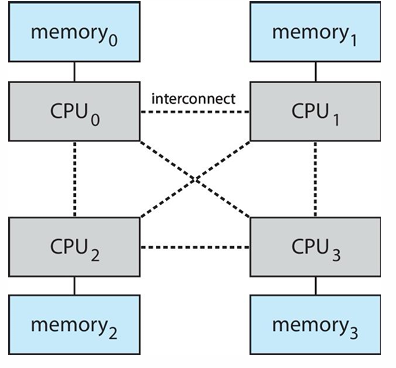
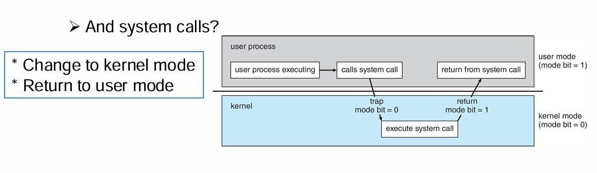

# 1. What is an Operating System?
**Definition**: Software that manages computer hardware and acts as an intermediary between users and hardware.

**Functions:**

- Provides a platform for application programs.

- Manages system resources (CPU, memory, I/O, storage).

- Controls program execution and handles errors.

**Key Views:**

- The OS is the program running at all times (kernel).

- It serves as both a resource allocator and control program.

- Exists to make the computer usable.

# 2. What Operating Systems Do

Coordinate system components:

- CPU, Memory, I/O Devices, Storage.

Allocate these resources efficiently among active programs.

# 3. Computer system organization
**Device Controllers:** Manage hardware devices (keyboard, mouse, etc.).

**Device Drivers:** Provide a uniform interface for each device controller.

Controllers inform drivers that they have finished their work through interrupts

**Interrupts:** Allow CPU and I/O to run concurrently.

- Hardware-generated signals handled by CPU via interrupt vectors.（ triggered by hardware, received by the CPU）

- Traps/Exceptions: Software-generated interrupts (errors or system calls).

# 4. Computer-System Architecture

## Classify according to the number of processors

**Single-Processor System:** One CPU handles all tasks.

**Multiprocessor System:** Multiple CPUs, symmetric multiprocessing (SMP).

### SMP — Symmetric Multiprocessing
**Definition:**
SMP (Symmetric Multiprocessing) is a computer architecture where two or more processors (CPUs) share a single, common memory and I/O system, and each CPU runs an identical copy of the OS.

**Key Characteristics:**

- All CPUs are equal peers — none is “master” or “slave.”

- Each CPU can run any process or thread.

- The OS decides which process runs on which CPU.

- All processors share:

    - Main memory

    - I/O devices

    - Operating system

**How it Works:**

- Each processor has its own cache and registers.

- When a process executes, the OS scheduler assigns it to any available CPU.

- CPUs coordinate through shared memory — this can cause memory contention if too many processors access memory simultaneously.

Evolved into multicore processors: more computing cores on a single chip.

*Note that SMP is also called UMA(uniform memory access).*

**Advantages:**

- Increased performance (parallel execution).

- Improved reliability (if one CPU fails, others continue).

- Simpler programming model compared to older multiprocessor designs.

**Disadvantages:**

- Shared memory can become a bottleneck as CPU count increases.

- Cache coherence (keeping each CPU’s cache consistent) adds complexity.

**problem statement**: Now a system can starve several processors at the same time, notably because only one processor can access the computer's memory at a time.

### NUMA — Non-Uniform Memory Access

**Definition:**
NUMA is a design that tries to overcome the scalability limits of UMA.
It divides memory into “local” and “remote” regions — each processor (or group of processors) has its own local memory, which it can access faster than memory belonging to other CPUs.

**Key Characteristics:**

Each CPU (or node) has:

- Local memory — faster access.

- Remote memory — slower access (connected via an interconnect bus).

The system still has a single address space, so the OS and programs can access all memory transparently.

**How it Works:**

- When a CPU needs data, it tries to use its local memory first.

- If data is in another CPU’s memory, access takes longer — hence “non-uniform.”

NUMA attempts to address the contention problem by providing separate memory for each processor, avoiding the performance hit when several processors attempt to address the same memory.

Reduces memory contention in multi-CPU systems:
- CPUs connected by a shared system interconnect
- Single address space for all CPU. The memory access time depends on the memory location relative to the processor.
- Under NUMA, a processor can access its own local memory faster than non-local memory (memory local to another processor or memory shared between processors).

**Advantages:**

- Scales better than UMA (more CPUs can be added).

- Reduces memory contention since each CPU has its own memory region.

**Disadvantages:**

- Performance depends on where data resides (local vs remote).

- More complex to manage and optimize for programmers and OS.

# 5. Operating System Operations
## Startup (Booting Process):

1. Bootstrap Program initializes registers, loads kernel.

2. Kernel starts system daemons.

3. OS waits for interrupts (hardware or software).

4. Handles requests (system calls) and returns control.

## Multiprogramming & Multitasking:

- Program: Passive code.

- Process: Active program in execution.

### Multiprogramming
**Definition**

Multiprogramming is the technique of keeping multiple programs in memory at the same time, so the CPU always has something to execute.

*"The OS chooses one process to run, and when it must wait (for example, for I/O), the CPU switches to another process."*

This prevents the CPU from sitting idle while one process waits for I/O operations like reading from a disk or network.

**Key Idea**

Before multiprogramming:

- The CPU would execute a single job (program) until it finished.

- If the job performed I/O (e.g., printing, reading), the CPU would remain idle.

With multiprogramming:

- Several programs are loaded into memory.

- The OS switches between them whenever one is waiting.

- The CPU utilization increases dramatically.

**How it Works**

1. Multiple programs (say A, B, C) are loaded into main memory.

2. The OS keeps track of each program’s state (ready, waiting, running).

3. The CPU Scheduler selects one process from the ready queue.

4. If the process requests I/O (like reading from disk):

5. The OS saves its state.

6. Switches the CPU to another ready process.

7. When I/O finishes, the waiting process returns to the ready queue.

**Advantages**

- Efficient CPU utilization (no idle time).

- Increased throughput (more jobs completed per unit time).

- Reduced waiting time (jobs make progress in parallel).

**Disadvantages**

- Requires more memory (to hold multiple programs).

- Complex OS design — needs job scheduling and memory management.

- Potential security and isolation issues between programs.

### Multitasking

**Definition**

Multitasking (or time-sharing) is an extension of multiprogramming that allows multiple processes to share the CPU rapidly, giving the illusion of simultaneous execution.

It’s essentially multiprogramming + time slicing for interactive use.

**Key Idea**

- In multiprogramming, the OS switches jobs when one is waiting (I/O-bound).

- In multitasking, the OS forces context switches frequently, even if a job is not waiting — to ensure responsiveness.

Each process gets a small time slice (e.g., 10–100 milliseconds) to run.
When that slice expires, a timer interrupt occurs, and the CPU switches to another process.

This makes it possible for:

- You to type in a document

- Listen to music

- Have a web browser open
… all at the same time 

**How it Works**

1. The OS maintains a ready queue of processes.

2. The CPU scheduler uses time slices (quanta).

3. When a process’s time expires, the OS performs a context switch:

    - Saves the current process’s state.

    - Loads the next process’s state.

- This happens fast enough that users feel multiple programs are running simultaneously.

**Advantages**

- Improved user interactivity.

- Efficient CPU sharing among active users/processes.

- Each program feels like it’s running simultaneously.

- Faster response time for user commands.

**Disadvantages**

- High overhead due to frequent context switches.

- CPU time slicing can slightly reduce throughput.

- More complex scheduling algorithms are required.

### The management of multiprogramming and multitasking requires:
 • A way to manage the memory when multiple processes use it
 • A way to choose which process runs next (called CPU scheduling)
 • A way to limit how a process can affect others
 • A higher level way to see memory (logical memory)
 • A file system with its corresponding storage management
 • A way to protect resources from inappropriate use
 • A way to allow processes to communicate with each other and transfer information
 • A way to enable execution synchronization to try to avoid that process are forever waiting for one another (deadlock)

# 6. Dual-Mode & Multimode Operation

**Purpose:** Prevent user programs from damaging the system.

**Modes:**

- Kernel Mode: OS code execution, full privileges.

- User Mode: Application execution, restricted access.

**System Calls:** Interface for user programs to request OS services.

- Parameters passed via registers, stack, or memory.

# 7. Timers
A timer makes sure the CPU doesn’t get stuck running one program forever — it forces the CPU to periodically give control back to the OS.

### Why Do We Need Timers?

**Without a timer:***

Once the OS gives CPU control to a user process, that process could run indefinitely, possibly hanging the system.

**With a timer:**

- The OS regains control automatically after a certain time.

- This allows fair CPU sharing and preemptive multitasking.

### How Timers Work (Step by Step)
**Step 1: Setting the Timer**

When the OS gives control of the CPU to a process:

- It also sets a timer with a specific count value (the time quantum).

- This value determines how long the process can run before being interrupted.

**Step 2: Countdown**

- The timer hardware is connected to the system clock (which ticks many times per second).

- On each tick, the timer decrements its counter.

**Step 3: Timer Interrupt**

- When the counter reaches zero, the timer sends an interrupt signal to the CPU.

- The CPU immediately pauses the currently running process.

- The control is transferred to the interrupt service routine (ISR) in the OS.

**Step 4: OS Regains Control**

The OS interrupt handler:

- Saves the state (registers, PC, etc.) of the interrupted process.

- Decides which process should run next (CPU scheduling).

- May restart the same process or switch to another one.

**Step 5: Restarting the Timer**

- Before giving CPU control again, the OS resets the timer with a new value.

- The cycle repeats — ensuring the OS always gets periodic control.

# 8. Operating System as a Resource Manager

Manages and coordinates system resources:

| **Resource Type** | **Responsibility**                                                                |
| ----------------- | --------------------------------------------------------------------------------- |
| **Processes**     | Creation, deletion, scheduling, synchronization, communication, deadlock handling |
| **Memory**        | Allocation, protection, virtual memory                                            |
| **File System**   | File creation, deletion, access control                                           |
| **Storage**       | Disk space management                                                             |
| **I/O System**    | Device drivers, buffering, caching, spooling                                      |

## 8.1. Process Management
The OS is responsible for the following activities in connection with process management
– Creating and deleting both user and system processes
– Suspending and resuming processes
– Providing mechanisms for process synchronization
– Providing mechanisms for process communication
– Providing mechanisms for deadlock hand

# 9. Security and Protection

**Protection:** Controls access of users/processes to resources.

- Prevent misuse (e.g., deleting all files with rm -r ./*).

**Security:** Safeguards system from internal/external threats.

- Examples: Viruses, DoS attacks.

**User Management:**

- UID/GID: Identify users and groups.

- Processes can escalate privileges using effective UIDs (e.g., passwd).

