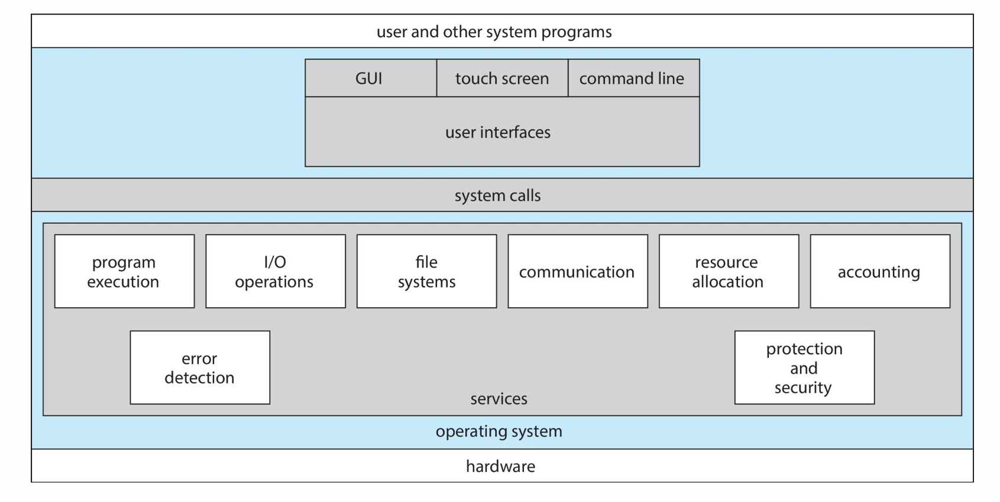
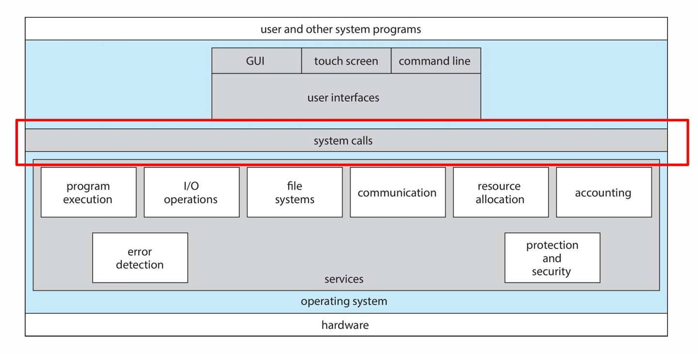
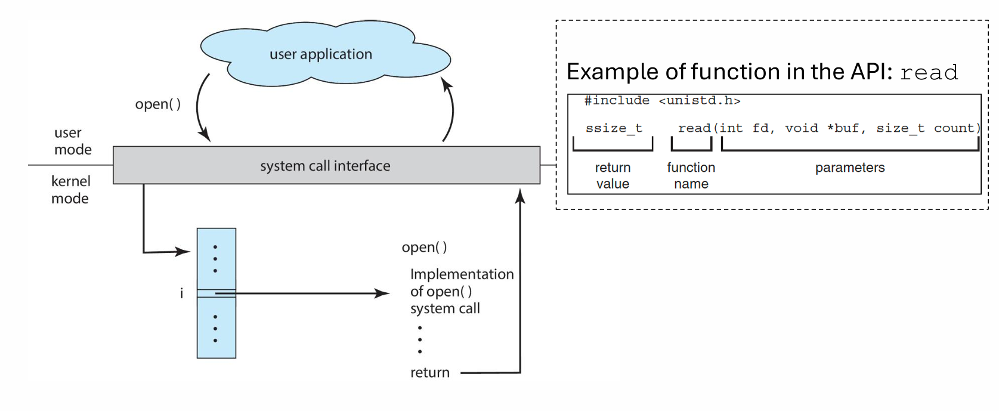
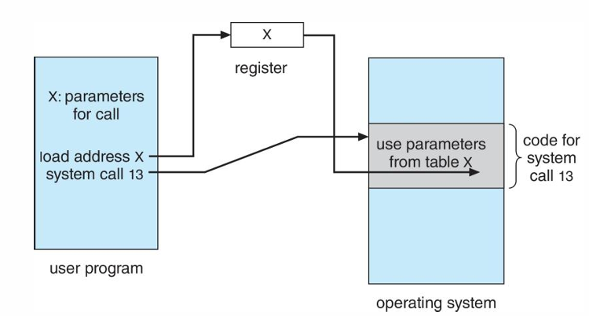
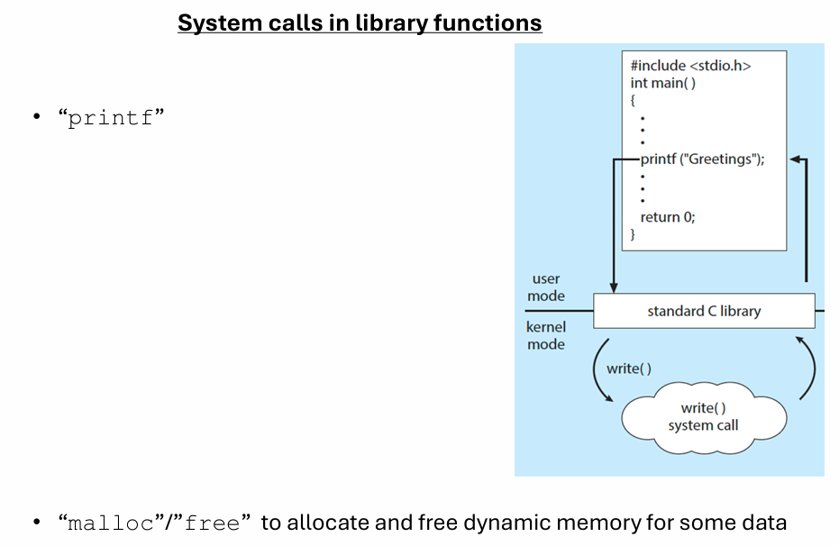
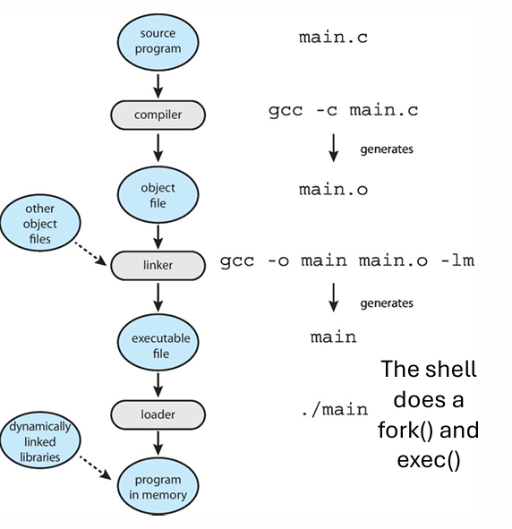
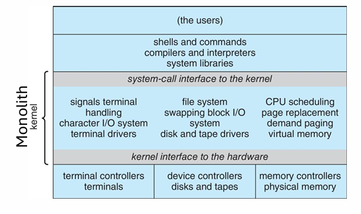
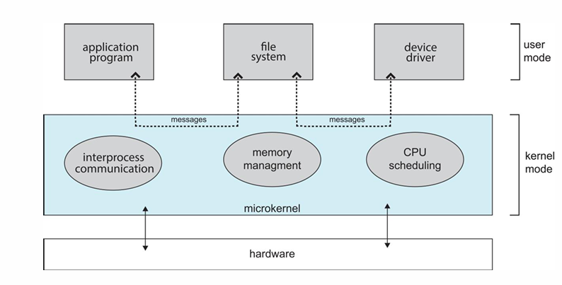

# 1. Bare-Metal Execution (No OS)
Very small microcontrollers (e.g., ATtiny4) run without an OS.

The programmer directly manages:

- Registers

- Memory

- I/O

**Problem:** No protection → if a program misbehaves, the entire system fails.

Used in embedded systems such as small sensors or control chips.

# 2. OS system overview
We view the OS from these points
- The services it provides
- The interfaces that it makes available for users and programmers
- Its components and interconnection


## 2.1 Services

### User-Helpful Services

#### User Interface: 
**What it is:** The UI is how humans interact with the OS and applications.

**Types & behavior**
1. **Graphical User Interface (GUI):** window+mouse+keyboard
   
2. **Command Line Interface (CLI, e.g. shell)**
    - Text-based interpreter (e.g., bash, zsh, cmd.exe, PowerShell).

    - Shell parses input, resolves commands, may run built-ins or spawn external programs (fork() + exec() on Unix).

    - Strengths: scripting/automation, low overhead, powerful for administrators and developers.

    - Typical system interactions: invoking execve(), I/O redirection (pipes), job control (signals like SIGCHLD, SIGINT).
3. **touch screen**
    - Mobile OS specifics: power management, sensor integration, more security sandboxing (app permissions).

#### Program execution: 
Load a program into memory and run it. 

#### I/O operations: 
controlled access to devices.

File-system manipulation: create, read, write, delete, search.

Communications: between processes or machines (shared memory, message passing).

Error detection: hardware & software monitoring, error handling.

## 2.2 User Interfaces(CLI, GUI, Touch)
### 2.2.1 CLI
A special program, the command interpreter (shell), handles this interface.

The shell function is to get and execute the next command.

Two ways CLI commands work:

1. Shell implements command internally (small built-in programs).
    - The shell “understands” the command. The shell contains the code to execute the command

2. Shell loads an external program (e.g., /bin/rm) and executes it.
    - Commands are implemented through system programs. The shell  does not understand the command.
    - It identifies the file to be loaded into memory and executed

### 2.2.2 GUI
**Examples:** Windows, icons, menus, pointer.
- Mouse-based window-and-menu system
- Icons representing elements in the filesystem
- Double-clicking, etc. 

Many systems combine both CLI and GUI 
- Part GUI in Linux KDE/Gnome, MS Windows, Mac OS X Aqua
- Part CLI makes repetitive parts  easier since they are programmable (scripts)

### 2.2.3 Touch-screen interface

- Gestures like tapping, swiping.

- Common on mobile systems

## 2.3 System calls

System calls are the programming interface between applications and the OS.

Apps don’t directly access hardware → they request OS services via system calls.

System calls are accessed via APIs.

### What's an API?
**Application Programming Interface**: A set of rules, protocols, and tools that allow different software applications to communicate with each other.

### Why do we need APIs?
Software systems are complex. Instead of directly manipulating hardware or internal kernel structures, we:

- Interact through structured requests.

- Use stable function signatures.

- Are shielded from complexity.

APIs provide:

- **Abstraction**:
    Hides complex internals.

- **Modularity**：
    Functions are grouped logically (file APIs, network APIs, process APIs).

- **Interoperability**：
    The ability of different systems, applications, or components to work together, communicate, and exchange data even if they are built differently.
    - example: A C program calling a library written in C++.

- **Reusability**


Without APIs, developers would need to understand kernel internals or hardware details for every simple task like printing or reading a file.

A benefit of using API instead of direct system calls is that system calls are HW architecture
dependent. Using an API enhances the program’s portability.



### Parameter Passing Methods
System calls  can require some parameters to execute (what to open, where to read, etc.)

There are three general methods for passing parameters:
- Pass the parameters in the CPU registers
- Store parameter values in a block in memory and pass in a register the address of that memory block 
    - To use when there are more parameters than registers
    
- Using the stack. Push/pop values (like function/methods invocation)

### API → System Call → Kernel Action
In OS context, an API typically refers to the programming interface used by applications to request OS services.

**Example:**
When a program wants to:

- read a file

- create a process

- allocate memory

It calls an API function like:

`fopen()`, `printf()`, `malloc()`, `CreateProcess()`, `WriteFile()`

These API functions eventually translate into system calls, which enter kernel mode.

But the developer never calls system calls directly—they use an API instead.

**Steps**:
1. Your program calls an API function
```c
FILE *f = fopen("data.txt", "r");
```
2. API prepares system call

    - Converts high-level parameters to low-level kernel format.

    - Validates parameters.

    - Calls the correct low-level system call (e.g., open() in POSIX).

3. System call triggers trap to kernel

    - A special CPU instruction switches from user mode → kernel mode.

4. Kernel executes privileged operation

    - Accesses filesystem.

    - Checks permissions.

    - Reads data blocks.

5. Return to user space

    - Kernel returns results to API wrapper.

    - API returns results to your application.

This layered flow makes programs portable, safer, and easier to write.

## 2.4 Types of system calls

### 2.4.1 Process controll
Manage process creation, termination, and execution.

Processes do not manage themselves — the OS must create, schedule, and terminate them.

- Create a process

- End a process

- Load/execute another program

- Get/Set process attributes

- Wait for child process

- Debugging/Tracing

- allocate and free memory

**Example:**
Unix/Linux:

- `fork()` → create a new process

- `execve()` → replace program memory with a new program

- `exit()` → exit process

- `wait() / waitpid()` → wait for child

- `kill()` → send signals

**Use case**
When you run a program from the shell:

1. Shell uses `fork()` to create a child.

2. Child uses `exec()` to load the new program.

3. Parent uses `wait()` to wait for program completion.

This is classic Unix process control.

### 2.4.2 File management
Create, delete, read, write, and manipulate files and directories.

Files are stored on disk; user applications can’t access disks directly, so the OS must mediate.

- Create/delete files

- Open/close files

- Read/write data

- Change file permissions

- Query file information (size, timestamps, owner, etc.)

**Use case**
Text editors, IDEs, compilers — essentially every application relies on file system calls.

**Example:**
Unix/Linux:

- `open()`, `close()`

- `read()`, `write()`

- `mkdir()`, `rmdir()`

### 2.4.3 Device management
Control access to hardware devices through IO operations.

**Why needed**

User programs cannot:

- talk to hardware directly

- manage interrupts

- access privileged I/O instructions

- The kernel must mediate these operations.

**Typical actions**

- Request/release a device

- Read/write to a device

- Get or set device attributes

- Perform low-level I/O operations

**Examples**
- `ioctl()` → control device parameters

- `read() / write()` → for device files /dev/tty, /dev/sda, etc.

- `open()` for device nodes


**Use case**
Printers, Keyboard/Mouse, Network devices, Disk drives, Cameras and sensors......

Device drivers provide the logic; system calls allow applications to use them safely.


### 2.4.4 Information Maintenance
Retrieve or change system-wide information.

**Why needed**

Programs may need details like:

- system time

- process ID

- memory usage

- user info

- file system status

These details are held by the kernel.

**Typical actions**

- Get time/date

- Get system or process information

- Set system time

- Query resource usage

**Examples**

- `getpid()` → get process ID

- `gettimeofday()`

- `uname()` (system info)

- `getrusage()` (resource usage stats)

- `sysinfo()`

**Use case**

Monitoring tools (top, htop, Task Manager) rely heavily on information-maintenance system calls.

### 2.4.5 Communication
Allow processes to communicate with each other, locally or across networks.

**Why needed**

Modern programs need to:

- send， receive messages

- share data

- synchronize execution

- connect over the network

Communication can be:

- IPC (Inter-process communication)

- Network communication

**IPC Mechanisms**

Pipes, Shared memory, Message queues, Sockets, Signals


**Examples**

Unix/Linux:

- `pipe()`

- `shmget()`, `shmat()`

- `msgsnd()`, `msgrcv()`

- `socket()`, `bind()`, `listen()`, `accept()`

- `send()`, `recv()`


**Use case**

Web browsers, multiplayer games, chat apps — all rely on communication system calls.


### 2.4.6 Protection
Ensure controlled access to resources so that users/processes cannot accidentally or intentionally damage the system.

**Why needed**


OSes must enforce: **security, isolation, restrictions, permissions**

These prevent risks such as:

- unauthorized access

- data corruption

- privilege escalation


**Typical actions**

- Set file permissions

- Check user identity

- Enforce access control

- Manage capabilities and security tokens

**Examples**

Unix/Linux:

- chmod() → change permissions

- chown() → change owner

- setuid() → change user ID

- umask()

**Use case**

- Preventing a normal user from deleting system files

- Ensuring a process cannot read another process’s memory

- Validating login credentials

### 2.5 System Services
Utilities that provide a convenient environment for program development and execution.

Some of them are simply user interfaces to system calls.

#### Key categories:

1. **File management:** for programs that need to copy, delete, create files and directories.

2. **Status info:**  for programs that need to ask for the date, memory, CPU info.

3. **File modification:** editors, text utilities.

4. **Programming tools:** compilers, debuggers, assemblers, interpreters.

5. **Program loading/execution:** programs need to be loaded into memory to be executed.

6. **Communications:**  create connections among processes, users, and computer systems. 
    - browsers, email, messaging

7. **Background services (daemons):** start at boot, run until shutdown. 
    - Some terminate after completing their tasks
    - Some continue to run until halting the system (services/daemons)

8. **Application program:** not part of the OS  but are used for common operations.
    - Web browser, text processor, spreadsheet, etc.

#### Differences between system calls and system services

System calls are low-level interfaces to the kernel, while system services are high-level user programs built on top of system calls to provide a convenient environment.


### 2.6 Linkers and loaders
Linkers and loaders are essential parts of the program-building process.
They are the bridge between source code and a running program in memory.

Let’s break it down.

**Compiler:** creates relocatable object files.

**Linker:** combines object files → single executable.

**Loader:** loads executable into memory to start running.


When you write a program, it is usually divided into multiple pieces:

- Your source files: main.c, utils.c, etc.

- External libraries: the C standard library (printf()), math library (sin()), etc.

- System libraries: OS-level functions, startup code.

When the compiler compiles a single .c file, it creates an object file with machine code but many things are missing, such as:

- References to external functions (printf, scanf, malloc)

- References to global variables in other files

- Addresses are unknown (where will this function go in memory?)

- Multiple modules must be combined

These incomplete object files cannot run by themselves.

**Why the linker is needed:**

- Combines all object files into a single executable

- Resolves symbol references (matches function calls to their actual definitions)

- Assigns final memory addresses to code and data

- Links against external libraries such as libc

- Produces a binary the OS can load

Without a linker, no program using multiple files or libraries would ever run.

**Why We Need a Loader:**
After linking, we get an executable file (e.g., ELF on Linux, PE on Windows).
But the program is still on disk.

To run it, the OS needs to:

- Allocate memory for it

- Map the code and data into memory

- Set up a stack and heap

- Load shared libraries (if dynamic linking)

- Set the CPU instruction pointer to the program’s entry point

- Start executing it

This is the loader’s job.

Without the loader, an executable file could never actually begin executing.

### 2.7 Operating-System Structure
OS is a large program, and partitioning the OS task into small components or modules seems to be a good engineering approach. 

#### 2.7.1 Monolithic Structure

- OS is a single large binary in one address space.

- High performance, but harder to maintain.

- Traditional Unix.

- Linux = monolithic + dynamic modules.



#### 2.7.2 Layered Structure

- OS divided into layers.

- Each layer uses the services of the layer below and provides services to above.

- Easier debugging and modification.

- Less flexible because strict layer communication.

#### 2.7.3 Microkernel Structure
- Remove all nonessential components from the kernel.
    Only essentials:

    - Process management

    - Memory management

    - IPC (Inter-process communication)
-  Most services run in user space.
- Communication between components uses message-passing

**Advantages:**
-  Easier to extend: new services are in the user space
- Easier to port to new architectures
- More security because most services run as user processes

**Disadvantages:**
- Lower performance since the communication needs to copy messages between services



#### 2.7.4 Modular (LKM – Loadable Kernel Modules)

- Core kernel + dynamically loadable modules.

- Modules can be loaded/unloaded at runtime.

- Used in Linux, macOS, Windows, Solaris.

**Advantages:**

- Flexible, efficient, no need for kernel recompilation.

- Combines benefits of layering + extensibility.

- No microkernel IPC overhead.

#### 2.7.5 Hybrid Structure

- Most real OSes combine multiple designs.

- **Example: Linux**

    - Monolithic base

    - Support for loadable modules