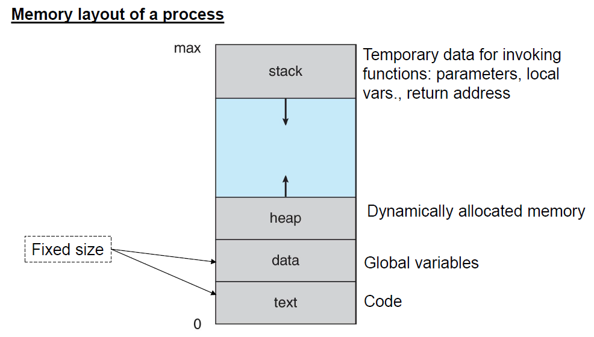
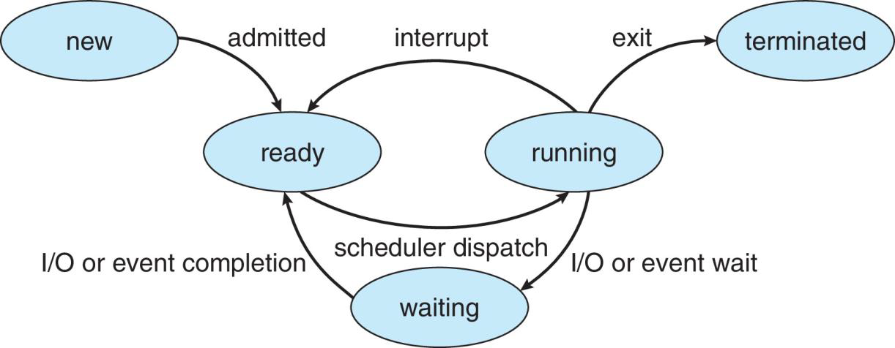
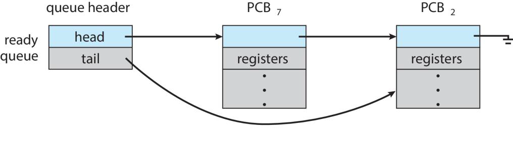
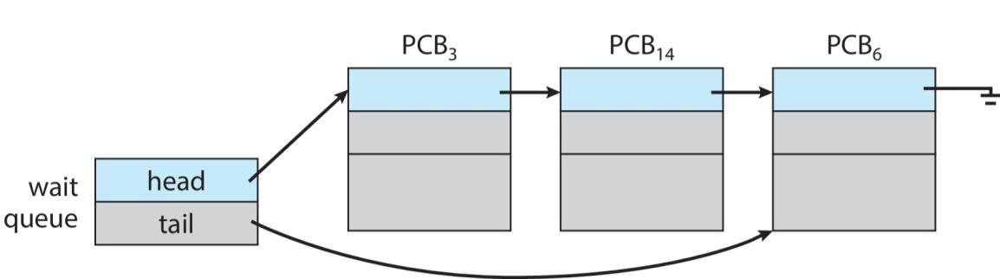
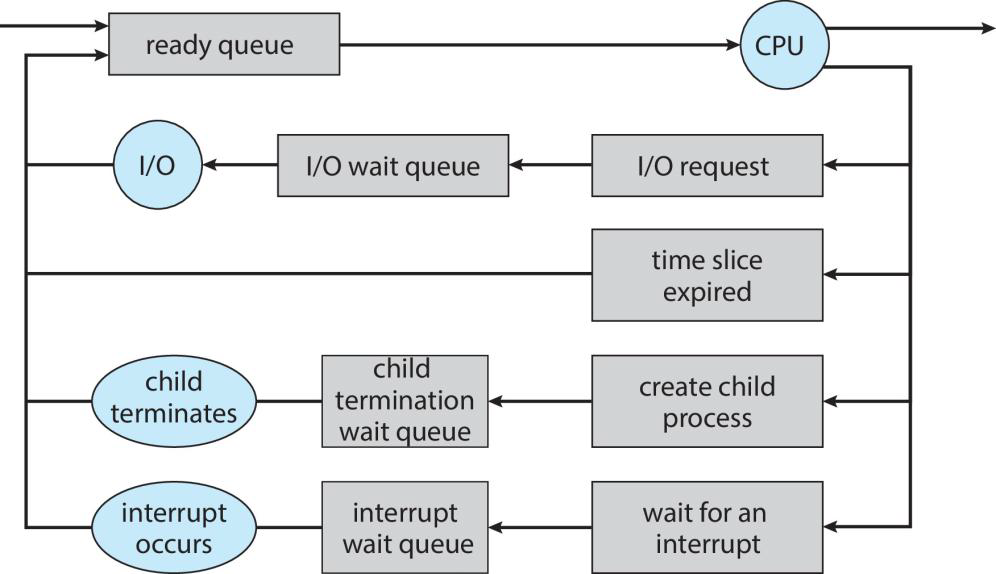
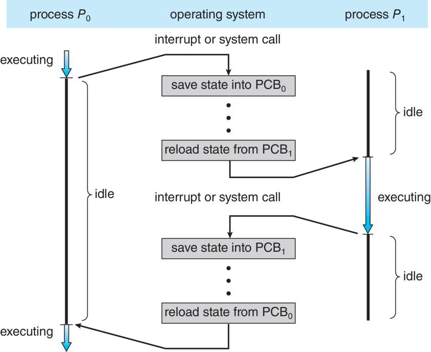
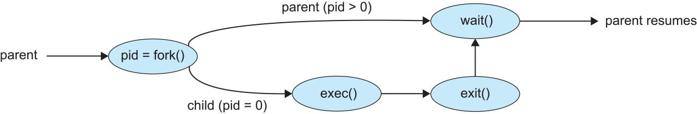
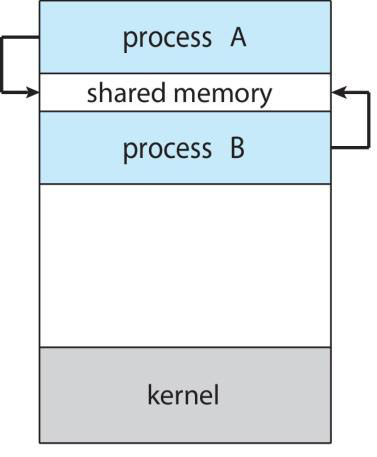
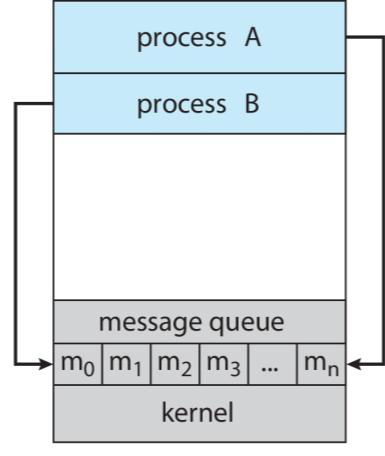

# 1. Process Concept
A process is a program in execution. A program is only passive code on disk, but a process is an active entity containing:

1. Program code (text segment)

2. Global variables (data segment)

3. Heap — for dynamically allocated memory (malloc, new)

4. Stack — function calls, parameters, return addresses

5. CPU registers

6. Program Counter (PC) — address of next instruction

7. Process ID (PID)

8. OS resources — open files, devices, signals, timers

- In current computers, multiple programs are executed concurrently.
    - Web browser, word processor, music player, etc.

- Several processes may be associated with the same program.
    - They have the same text section, different data, heap, and stack.
        - Different PIDs, Different memory, Separate stacks, Independent execution states
    - Example: several web browsers opened,notepad

# 2. Process State
At any time, a process is in one of several well-defined states:

**New → Ready → Running → Waiting → Ready → Running → … → Terminated**

Only one process can be in the runningstate on any processor core at any instant. Many can be waiting or ready.

1. New: Process is being created.

2. Ready: Process is loaded into memory, waiting for CPU.

3. Running: Actually being executed by the CPU.

4. Waiting / Blocked: Process is not using CPU because it waits for an event:

    - I/O completion

    - Child process to finish

    - Waiting for a lock

    - Waiting for a message

5. Terminated: Finished execution; OS cleans up resources.

# 3. Process Control Block (PCB)
Every process has a PCB, which stores everything the OS needs to manage and switch between processes.

**PCB contains:**

- Process ID (PID)

- Program counter

- CPU registers

- Process state

- Scheduling information (priority, time slice)

- Memory info (page tables, segment tables)

- Accounting info (CPU usage, time limits)

- I/O status (open files, devices)

The PCB is stored in kernel memory (protected).
Without the PCB, context switching would be impossible.

# 4. Threads
A process can perform multiple tasks at the same time.

A thread is an execution path within a process.

On systems that support threads, the PCB needs to be expanded to include information of each tread of the process.

**All threads share:**

- Code

- Data

- Heap

- Files

**But each thread has its own:**

- Registers

- Stack

- Program counter

**Multithreading improves:**

- Responsiveness

- Resource sharing

- Performance (multiple cores)

- Scalability

# 5. Process Scheduling
The OS decides which process runs next.

### 5.1 Scheduling queues
Two queue types: a Ready queue (more in Ch. 5) and a set of Wait queues。
#### 1. Ready queue

Processes ready and waiting for the CPU.

- A new process is initially put in the Ready queue.

#### 2. Wait queues

Processes waiting for I/O or an event.

### 5.2 CPU Scheduler
Selects a ready process to run next.

Scheduling happens:

- On process creation

- When a process switches from running → waiting

- When a process terminates

- On timer interrupts (preemptive scheduling)

When a process is chosen for running (dispatched), this can happen:
- It issues an I/O request
- Creates a child and awaits its termination
- An interruption happens(ex. Timer) and it is removed from the CPU
- Waits for interruption(nothing to do now)
- It terminates

# 6. Context Switching

A context switch occurs when the CPU changes from running one process to another.

The context of a process is represented by its PCB.

**Steps:**

- Save current process state (PCB)

- Load another process’s PCB

- Restore registers & program counter

- Run the new process

Context switching takes:

- Time

- CPU cycles

- Must be fast → affects performance

It's **pure overhead** (no progress of actual program).

Some processors provide multiple sets of registers：
- It allows multiple contexts to be loaded at the same time.
    - That makes the switch faster because it only needs to change the pointer to the current register set.
- But if there are more processes than register sets, it is still needed to copy data to and from memory during the context switch

# 7. Operations on Processes
## 7.1 Process Creation
### High-level picture: Why creating a process is non-trivial

Creating a process means turning code on disk into a running instance with:

- its own CPU state (PC, registers),

- address space (text, data, heap, stack),

- OS-managed metadata (PID, PCB),

- OS resources (file descriptors, signals, credentials),

- runtime environment (argv, envp, open files).

That requires cooperation between user-space runtime/library, kernel, and loader/dynamic linker.

### Unix-style process creation: fork() + exec() (classic model)

A child process may obtain resources from:
1. the OS directly, or
2. be restricted to a subset of its parent resources
    - protects the system from overloading with too many children

When a process is created, Two possibilities exist for the parent:
1. It continues to execute concurrently with the children
2. It waits for the termination of the children to continue

Two possible address spaces for the new process
1. It is a duplicate of the parent (same code and data)
2. It has a new program

In the UNIX family, a process is created with `fork()`;
- The child is **a copy of the parent's address space**
    - It is easy for the parent to communicate parameters to the child
- **Both processes continue** with the instruction after `fork()`

- pid = `fork()`;

    - Returns <0 on error.

    - Returns 0 in the child.

    - Returns child PID (>0) in the parent.

## 7.2 Process Termination
Processes terminate using the system call:

- `exit()` → normal termination

Parent is notified:

- `wait()` → collects child’s exit code

The process is terminated by another process.

The parent may have the rights and information necessary (PID) to terminate/kill it. 
**Reasons to kill a process:**
- The process has exceeded its usage of resources
- The task assigned to the child is no longer required (parallel solve)
- The parent is terminating, and the OS does not allow children without parents
    - It is called cascading termination and is normally initiated by the OS (not the parent itself), affecting all the process subtree.

When a process terminates, its resources are deallocated, but its entry in the process table remains until the parent calls wait().

### Zombie process

When a process terminates, kernel frees most resources but keeps an entry in process table to store the exit status so parent can collect it with `wait()`/`waitpid()`.

Process in this state = zombie. It occupies a PID (and table slot) but no memory.

Parent must `wait()` to reap; otherwise zombies accumulate.

### Orphan process

If parent dies before child, the child is reparented to init (PID 1) or to a reaper service (e.g., systemd).

init (or systemd) periodically calls `wait()` to collect orphaned children, preventing zombies.

- Root parent process:

    On Linux, PID 1 = systemd

    Responsible for adopting orphan processes

# 8. Interprocess Communication
An independent process does not share data with any other process.
A cooperating process can affect or be affected by other processes.

**Reasons to cooperate among processes:**

- Information sharing: Processes interested in the same info (C&P)
- Computation speedup: break task into parallel subtasks
- Modularity: Divide the function into separated processes/threads

The OS should provide the environment to cooperate.

The mechanism is called interprocess communication (IPC).

**Two models of IPC:**
1. Shared memory
    - A region of memory shared by cooperating processes
2. Message passing
    - Messages exchanged between cooperation processes

## 8.1 Shared Memory
- Typically, a process creates a shared-memory region in its address space.
- Other processes must attach it to their address space.
- Process memory space is protected by the OS to avoid unwanted sharing.
    - The processes must agree on removing this restriction.
- The data shared is not under the OS control.
- The processes must handle the synchronization to avoid simultaneous writing and race conditions.
- Threat: Race Condition - Occurs when two processes change shared data unpredictably.

## 8.2 Message Passing
Processes communicate by sending and receiving messages, with OS help.

**Used when:**

- Processes need isolation

- Data should be protected

- Processes are on different machines

- Shared memory is unsafe

The OS provides the means for cooperating processes.

Processes can synchronize their actions without sharing the same address space.

The message-passing mechanism must provide at least operations:
1. Send(message)
2. Receive(message)

There must exist a **communication link** between the processes. The communication link can have different **characteristics**:
- Direct or indirect communication
- Synchronous or asynchronous communication
- Automatic or explicit buffering

### Producer–Consumer Problem
**Producer:** Generates data and adds it to the buffer.

**Consumer:** Removes data from the buffer.

**Requires synchronization because:**

- Producer shouldn’t add when buffer is FULL

- Consumer shouldn’t remove when buffer is EMPTY

- Buffer must not be corrupted (race conditions)

### Message Passing Properties
#### 1. Naming (direct or indirect communication)
Naming determines who sends and who receives.

**1.1 Direct: send to specific process ID**

**Characteristics**

- Sender must know the exact identity (PID/endpoint) of the receiver.

- The communication path is hard-wired and fixed.

- Common in simple systems or tightly-coupled tasks.

**Types:**
- **Symmetric case**: Processes need to name the recipient explicitly
    - Send(P, message) –Send a message to process P
    - Receive(Q, message) –Receive a message from process Q
    There is a link between each pair of processes:
        - A link is associated with exactly two processes (no more)
        - Between two processes there is only one link
- **Asymmetric case**: Only the sender needs to know the recipient.
    - Receive(id, message) –Receive from any, save who in id

**Advantages**

- Easy to implement

- Low overhead

- Direct flow → low latency

**Disadvantages**

- Not flexible — if process P2 is replaced or restarted, P1 must know the new address.

- Hard to scale to many-to-many communication.

- Failures propagate (if P2 dies → P1’s send blocks or fails).

**1.2 Indirect: send to mailbox/port**
Processes communicate through a mailbox, port, or queue, not directly with each other.

**Format:**
- send(mailboxA, message)
- receive(mailboxA, message)

Each mailbox has a unique identifier

**How it works**

- Multiple producers → same mailbox

- Multiple consumers ← same mailbox

- Mailbox is a kernel-managed queue

**Advantages**

- Very flexible

- Many-to-many communication

- Processes do NOT need to know each other

- Decouples sender and receiver (loose coupling)

- If a process restarts, mailbox persists → communication continues

**Disadvantages**

- Requires mailbox creation/management

- Harder debugging

- More kernel overhead

If there is more than one process that receives from a mailbox, which one should get the message? Possible solutions:
1. Allow a link to be associated with two processes at most
2. Allow at most one process to execute the receive()at a time
3. Allow the system to receive arbitrarily

#### 2. Synchronous or asynchronous communication (AKA blocking or non-blocking)
Message passing works in two dimensions:

1) Does the sender wait?
2) Does the receiver wait?

##### Analysis
**1. Blocking Send**
the sender blocks until the message is received.

**Use case:**

- When order of communication must be preserved

- When the sender cannot continue without receiver confirmation

**2. Non-blocking Send**
the sender does not wait.

- Message copied into system buffer

- Sender continues immediately

**Use case:**

- When the sender must send multiple messages

**Pros:**

- High performance and concurrency

- Good for pipelines, logging, streaming

**Cons:**

- Messages may be dropped if buffer is full (depends on system)

- Sender does not know if receiver actually received the message

**3. Blocking Receive**
the receiver blocks until a message is received.

- Receiver is put into "blocked" state

- Scheduler picks another runnable process

- Receiver wakes once a message is available

**Use case:**

- When the receiver cannot continue without a message (Event-driven systems waiting for input)

**4. Non-blocking Receive**
the receiver does not wait.

- Receiver checks if a message is available

- If not, receiver continues immediately

**Use case:**

- Polling loops

**SPECIAL CASE: Rendezvous (Synchronous Message Passing)**
This is the most strict form of synchronization.

Both sides block：

- Sender blocks until receiver executes receive

- Receiver blocks until sender executes send

No buffering — messages handed directly：

- No intermediate storage

- Used for strict handshaking

- Ensures exact ordering

#### 3. Buffering (automatic or explicit)
In direct and indirect communication, messages exchanged may reside in a temporal queue. Capacity possibilities:
**1. Zero Capacity (No Buffering)**
No messages can be stored.

Sender must wait until receiver is ready.

**Pros:**

- No lost messages

- No need for large memory

- Predictable timing

**Cons:**

- Performance limited by synchronization

- Sender/receiver tightly coupled

**2. Bounded Capacity**
A fixed-size queue (length = N).

**Behavior:**

- If buffer not full, sender continues

- If buffer full, sender must block or fail

- Receiver blocks only if buffer empty

**Pros:**

- Efficient pipeline parallelism

- Smooth flow unless buffer exceeds capacity

**Cons:**

- If producers faster than consumers → buffer fills → blocking

- Must tune buffer size

**3. Unbounded capacity**
queue length potentially infinite.
This is idealized.