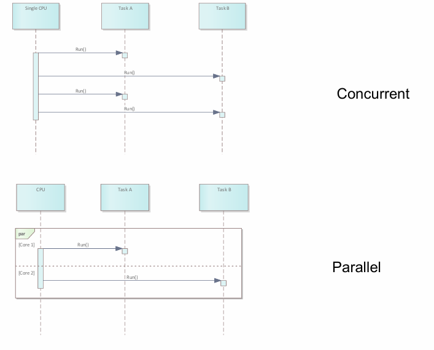
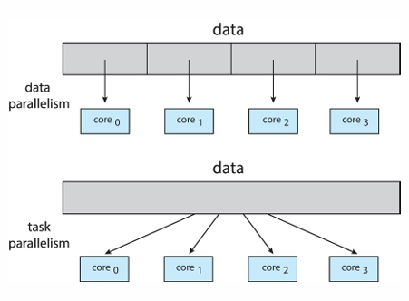
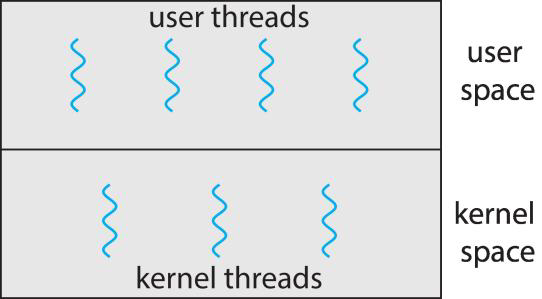
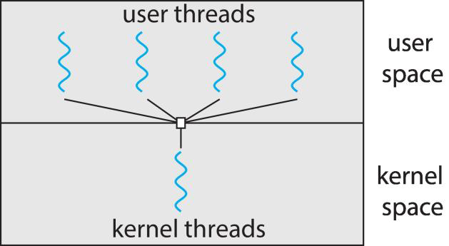
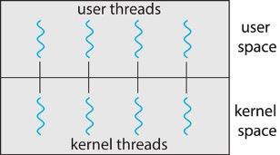
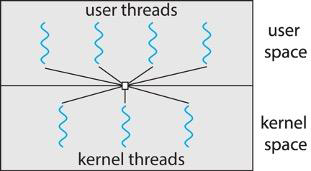
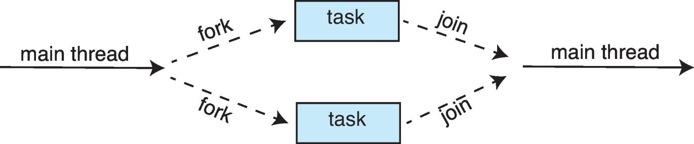
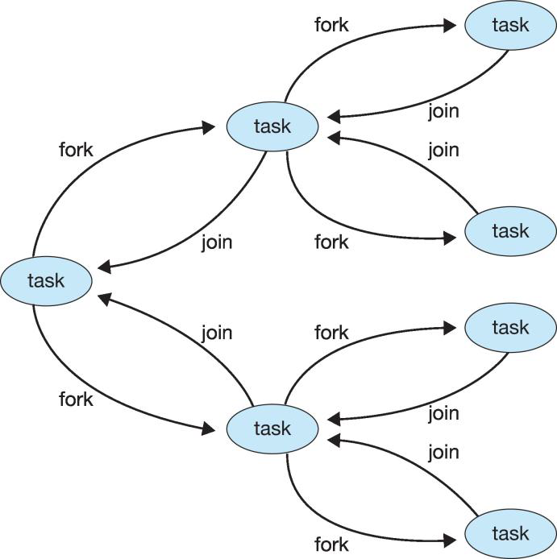

# 1. What is a Thread?
A thread is the **basic unit of CPU execution**. A process may contain one or more threads.

It **shares** with other threads of the same process
- Code section
- Data section
- OS resources such as open files or signals

It **owns**
- Thread ID
- Program counter
- Register set
- Stack

#### Why does this matter?

It allows multiple independent paths of execution inside the same process.

**Example:**
If a program has 10 threads:

- They all run the same program, but independently

- They use the same memory → efficient communication

- They differ only in execution state (PC, registers, stack)

# 2. Motivation for Multithreading
Modern applications must do multiple things at once.

### Examples:

1. Word processor:

    - One thread handles input

    - One thread does spell checking

    - One thread renders the screen

2. Web server:

    - For each incoming request, create a new thread

    - Allows server to handle thousands of clients concurrently

### Benefits of multithreading:
#### 1. Responsiveness

The UI remains active even if part of the program is blocked (I/O, long tasks).

#### 2. Resource Sharing

Threads share the same data section → no need for shared memory setup.

But this also introduces risks: race conditions, inconsistent data.

#### 3. Economy
Creating a thread is more efficient than creating a process, in terms of time needed and memory used.

It is:
- Faster than creating a process

- Lighter on memory

- Requires fewer kernel data structures

#### 4. Scalability
take advantage of multiprocessor/multicore architecture.
Threads allow programs to use multiple CPU cores concurrently.

# 3. Multicore Programming
## 3.1. What is Multicore?
### Before multicore:

Only one core existed → concurrency was a illusion via rapid context switching.

### Now:

True **parallelism** exists:

Two tasks can run **simultaneously** on **different cores**.

### Concurrency vs Parallelism

- **Concurrent** = tasks make progress in overlapping time (may still use 1 core)

- **Parallel** = tasks execute at the exact same time, physically in parallel

## 3.2. Challenges in Multicore Programming
Programmers are pressured to make better use of computing cores.

**Programmers must:**

### 1. Identify independent tasks

Not all tasks can run in parallel due to data dependencies.

### 2. Balance work across threads

If task A takes 10 seconds and task B takes 1 second → poor load balancing.

### 3. Partition data

Each thread needs its share of the data (e.g., divide array into chunks).

### 4. Synchronize

Ensure threads do not corrupt shared data.

### 5. Testing is harder

Many bugs only appear under rare timing conditions → hard to reproduce.

## 3.3. Types of parallelism
### 3.3.1. Data Parallelism

Same operation on different chunks of data.

**Example:**

- Array of size N

- M cores → each core gets N/M elements

**Used in:**

- Graphics processing

- Matrix operations

- Parallel sorting

### 3.3.2 Task Parallelism

Different tasks run simultaneously

**Example:**

Core 1 → sum array

Core 2 → find max

Core 3 → compute average

**Used in:**

- Web servers

- Games

- Complex UIs

# 4. Multithreading Models
## Types of threads:
- User thread: management done by user-level library
- Kernel thread: supported by the kernel

## Models of multithreading
These models explain how user threads map to kernel threads.

## 1. Many-to-One

Many user threads → mapped to one kernel thread

All user threads run on **ONE CPU core**

Blocking system call blocks the entire process
→ NO parallelism

Used by: Ancient thread libraries (e.g., old GNU portable threads)

## 2. One-to-One

Each user thread maps to one kernel thread

True parallelism possible

**But:** too many threads → too many kernel context switches → burden the 
performance(overhead)

Used by: Linux, Windows, modern UNIX

## 3. Many-to-Many

Many user threads → mapped to smaller or equal number of kernel threads

Kernel threads decide how to schedule user threads

#### Pros:

- Good concurrency

- Flexible

#### Cons:

- Complex to implement

## 4. Two-Level Model

Variation of **many-to-many**

Optionally **bind one user thread** to a specific kernel thread

Used to optimize performance-critical threads.

# 5. Thread Libraries
A thread library provide programmers with an API for creating and managing threads.

## Implementations:

### 1. User-space threads
Entirely in user space. No kernel support.

- No system calls → faster

- But if one thread blocks → ALL user threads block

### 2. Kernel-level threads
- Library functions typically rely on system calls

- OS manages threads

- True parallelism

- Slower to create (system call required)

## Main APIs:

- POSIX Threads (Pthreads) → C/C++/UNIX/Linux
    In POSIX and Windows, the global data shared among all threads.
    - POSIX=Portable Operating System Interface

- Windows Threads → Windows OS

- Java Threads → JVM uses OS threads

## Thread Creation Strategies
### Asynchronous Threading

- Parent creates child → both run concurrently

- Parent does not wait

Used in UI and servers.

### Synchronous Threading

- Parent creates children

- Parent waits for all children to finish

- Children can run concurrently among themselves

Used when parent combines children's results (divide-and-conquer algorithms).

## Java Threading Model
### Two ways to create a thread in Java:
1. Create a class that extendsthe Threadclass and override the run() method

2. Create a class that implements the Runnable interface and pass an instance to the Thread constructor.
    - The parent waits for the children to complete in a join()
    - The join() may throw anInterrupedException

### The Java Executor Framework
Divides the **thread creation** from the **execution**.

Available in the `java.util.concurrent` package.

Allows threads to return results:
- The object passed to the Executor Service, whose code will be executed in a thread, must implement the Callable interface.
- The Executor Service, after the submit() of the object, will internally invoke the call() method

**Usage**:
It allows creating a pool of threads that receive and execute tasks (Thread pools).

**Benefits:**

- Prevents unlimited thread creation

- Efficient task scheduling

# 6. Implicit Threading
## 6.1 Definition
Implicit Threading is an approach where the **programmer does not explicitly create or manage threads**.

Instead, the **runtime system, compiler, or framework** automatically:

- creates threads

- schedules tasks

- allocates work to threads

- manages synchronization

- handles thread lifecycle (start, stop, destroy)

In other words:

"Instead of you creating threads manually (e.g., new Thread() or pthread_create()), the system hides the complexity and manages concurrency for you."

This makes parallel programming **simpler, safer, and more scalable**.

## 6.2 Reasons Why We Need Implicit Threading
Explicit threading (traditional threading) is hard for programmers because:

#### 1. Creating and destroying threads is expensive

Creating hundreds or thousands of threads wastes CPU time and memory. Implicit threading avoids this with thread pools.

#### 2. Programmers often create too many or too few threads

Implicit threading systems choose thread counts automatically.

#### 3. Thread scheduling is hard
- Programmers may write inefficient code: 
    too many blocked threads, CPU underutilization, uneven workload distribution.

- Frameworks (executor service, fork-join, OpenMP) schedule tasks efficiently.

#### 4. Synchronization errors occur easily

- Manual threads commonly cause: race conditions, deadlocks, livelocks, starvation.

- Implicit threading frameworks often use safe task-based models that reduce shared data.

#### 5. Multicore CPUs require parallelism

Explicitly coding for many cores is complex.
Implicit threading automatically splits work across CPUs.

#### 6. Modern applications need massive concurrency

Servers and distributed systems need thousands of simultaneous tasks.

Implicit threading enables scalable concurrency models like thread pools and event loops.

## 6.3 Methods of Implicit Threading

### Method 1: Thread Pools
(Most important method — heavily used in real systems)

#### Definition

A thread pool is a collection of **pre-created threads** that wait for tasks to be assigned.
Threads are **reused** → no need to create a new thread each time.

#### Why thread pools?

Creating a thread:

- takes time

- consumes memory

- increases CPU overhead

- causes performance issues when too many threads exist

Thread pools solve this by:

- reusing existing threads

- limiting number of threads

- controlling concurrency

#### How it works

1. System creates a fixed number of threads at startup

2. Threads wait in an idle queue

3. When a task arrives:

    - a free thread picks it up

    - executes it

4. After finishing, thread returns to the pool

#### Examples:

- Java Executor Framework (Executors.newFixedThreadPool())

- Web servers (Apache, Nginx worker pools)

- Databases

#### Advantages:

- Faster task handling

- No overhead of repeated thread creation

- Prevents too many threads from being created

- Easy for programmer — just submit tasks

Thread pools are the standard for building efficient, high-performance servers.

### Method 2: Fork-Join Model (Divide and Conquer Parallelism)

#### Definition

Fork-Join is a parallel programming model where:

- The task is split (forked) into smaller subtasks

- Each subtask runs in parallel

- When all subtasks finish, their results are joined together

This is ideal for:

- recursive tasks

- divide-and-conquer algorithms

- processing large data arrays

#### Why Fork-Join?

Some problems naturally split into parts:

- Sorting (merge sort/pivot algorithms)

- Matrix operations

- Parallel search

- Image processing

Rather than manually creating threads, the system automatically:

- splits work

- schedules subtasks

- merges results

#### How it works

1. Parent thread divides work into N subtasks

2. Subtasks run in parallel

3. When all children complete, parent collects results

4. Parent combines (joins) all results

#### Example (Java ForkJoinPool)

In Java: to be used by recursive divide and conquer algorithms.

#### Advantages:

- Efficient parallel recursion

- Uses work-stealing (idle threads steal tasks from others)

- Optimal use of multicore CPUs

- Programmer focuses on the algorithm, not thread management

# 7. Threading Issues
## 7.1. fork() and exec()

**If multithreaded process calls fork()**:

Should all threads be duplicated?

- Some UNIX systems only duplicate the calling thread.

- If exec() is called right after fork, duplicating all threads is wasteful.

## 7.2. Signal Handling

#### Signals life cycle:

1. Generated

2. Delivered to a process

3. Handled (default or custom handler)

In multithreaded programs: **Where should signal go?**

#### Possible policies:

- To the thread that caused the signal (e.g., divide-by-zero)

- To ALL threads (e.g., Ctrl+C)

- To the first thread not blocking the signal

- To a dedicated signal-handling thread (POSIX supports this)

## 7.3. Thread Cancellation

**Terminate thread before completion.**

Two types:

### Asynchronous

- Stop thread immediately

- Dangerous → may leave data in inconsistent state

### Deferred

- Thread checks periodically if it should stop

- Safe in Java using:

    - interrupt()

    - isInterrupted()