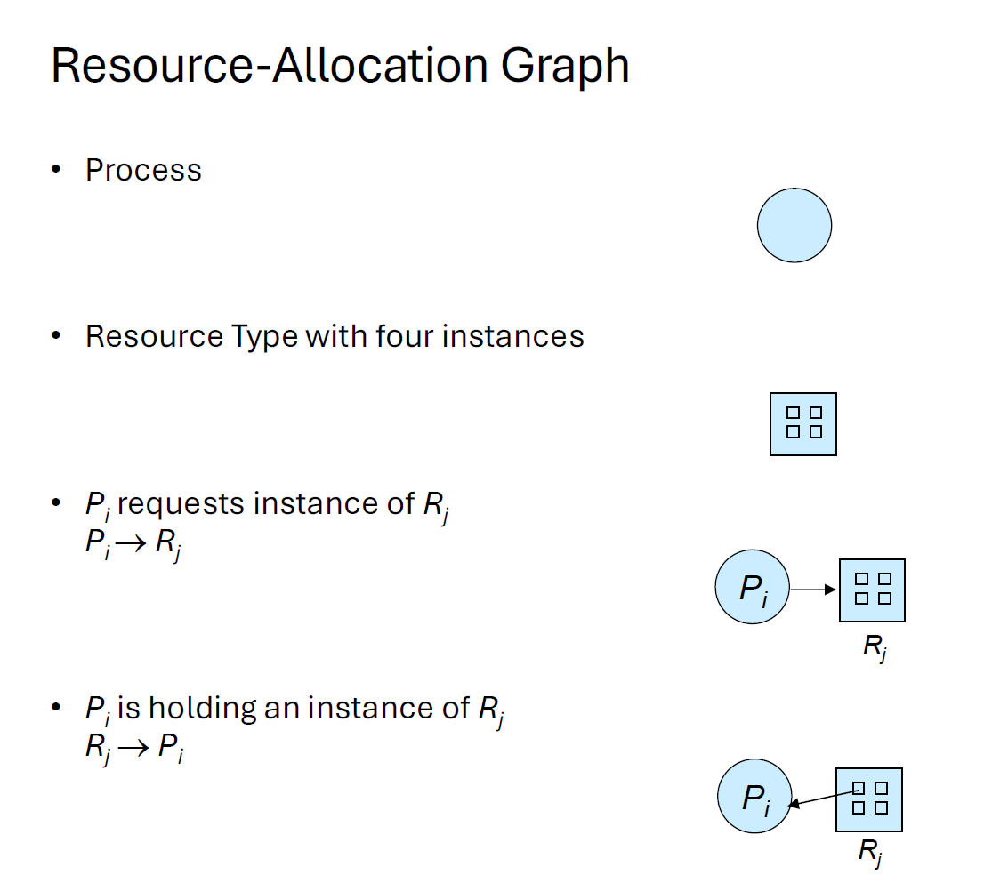
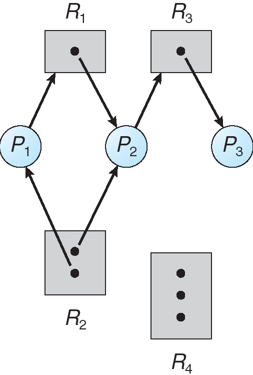
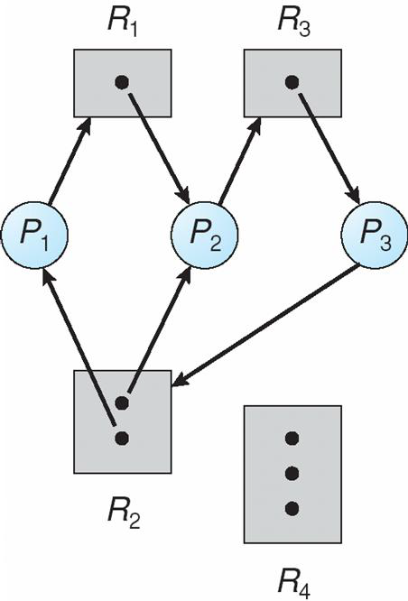
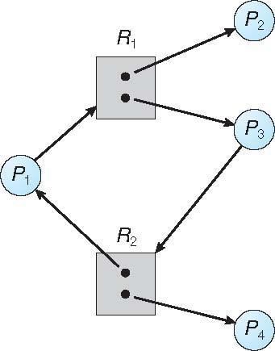

# Lecture 7 – Deadlocks (Summary Notes)

## 1. What is a Deadlock?
A **deadlock** occurs when a set of processes/threads are permanently blocked because each is waiting for resources held by others in the set.  
None can proceed → system makes no progress.

Typical resource usage sequence:
1. Request
2. Use
3. Release

Deadlock happens when processes are stuck at the **request** step forever.

---

## 2. Deadlock Conditions (All 4 Must Hold)
A deadlock can occur only if **all four** conditions exist:

1. **Mutual Exclusion**  
   Resources cannot be shared; only one process at a time can use them.

2. **Hold and Wait**  
   Process holds at least one resource while requesting more.

3. **No Preemption**  
   Resources cannot be forcefully taken; must be voluntarily released.

4. **Circular Wait**  
   A circular chain of processes exists where each waits for a resource held by the next.

Break ANY of the four → deadlock cannot occur.

---

## 3. Deadlock vs Livelock
- **Deadlock:** Processes are blocked forever.  
- **Livelock:** Processes continue running but make no progress (e.g., constantly retrying).

---

## 4. Resource-Allocation Graph (RAG)
- Processes: circles  
- Resources: squares  
- Request edge: Process → Resource  
- Assignment edge: Resource → Process  

Interpretation:
- **No cycle:** No deadlock  
- **Cycle:**  
  - Single-instance resources → deadlock  
  - Multiple-instance resources → deadlock *possible* (not guaranteed)

**No Deadlock:**
1. P1 is holding an instance of resource type R2 and is waiting for an instance of resource type R1.
2. P2 is holding an instance of R1 and an instance of R2 and is waiting for an instance of R3.
3. P3 is holding an instance of R3.
Graph has no cycle → no deadlock.

**Deadlock:**

Add P3 → R2
- P1 → R1 → P2 → R3 → P3 → R2 → P1 (cycle)
- P2 → R3 → P3 → R2 → P2 (cycle)

P1, P2 and P3 are deadlocked.

**Graph with a cycle but no deadlock:**

There is a cycle P1 → R1 → P3 → R2 → P1!
- When P2 or P4 releases a resource then the cycle will be broken → no deadlock
- So, there are cases where there is a cycle but no deadlock occurs.

---

## 5. Methods for Handling Deadlocks

### A. **Deadlock Prevention**
Ensure at least **one** of the four conditions is violated.

- **Break Mutual Exclusion:** Make resources sharable (rarely feasible).
- **Break Hold and Wait:**  
  - Request all resources at once, or  
  - Release held resources before requesting new ones.
  **CON of both:** poor resource utilization (allocated for long but not used) and possible starvation if a thread needs some popular resources
- **Break No Preemption:**  
  - **Allow preemption of resources:** case that a thread T holds some resources and requests some others
  - **Option 1:**
    - If the requested are available → allocate them to T
    - Otherwise → T releases the resources currently holding
  - **Option 2:**
    - If the requested are available → allocate them to T
    - If not available but held by another thread, U, which, in turn, is waiting for other resources, → preempts U resources and allocates them to T.
    - If not available and not held by other waiting threads → T waits
        - And its subset of currently allocated resources may be preempted if other thread requests them.
  - Apply this protocol to resources that we can **easily save the state and restore later**: CPU registers, database transactions. No to mutex and semaphores in general, or we will get **data corruption**.
- **Break Circular Wait:**  
  - Impose a total order on resources; request in increasing order.
  - Practical and commonly used.

These methods ensure that one of the necessary conditions does not occur.
But they are quite restrictive: they may cause low device utilization and reduced system throughput.
Deadlock avoidance aims at mitigating the downsides, but it requires additional information.
---

### B. **Deadlock Avoidance**
Requires processes to declare future resource needs.  
OS checks if granting a request keeps system in a **safe state**.  
(Leads into Banker’s Algorithm in later lectures.)

---

### C. **Deadlock Detection and Recovery**
Allow deadlocks to occur, then detect and fix.

#### Detection:
- OS periodically checks for cycles in RAG.
- If a cycle exists → deadlock detected.

#### Recovery:
1. **Process Termination**
   - Kill all deadlocked processes, or
   - Kill one at a time until cycle breaks  
     (choose victim using priority, runtime, resources held/needed, etc.)

2. **Resource Preemption**
   - Take resources away from processes.
   - Roll back process to a safe state.
   - Ensure no starvation (track how many rollbacks).
    - Starvation: same process may always be picked as victim, include number of rollback in cost factor

---

## 6. Summary
- Deadlocks arise from bad resource allocation patterns.
- All 4 conditions must hold.
- We can deal with deadlocks using:
  - Prevention (stop them),  
  - Avoidance (predict them),  
  - Detection & Recovery (fix after they occur).
- Most operating systems **ignore** deadlocks and rely on programmers to avoid them.

