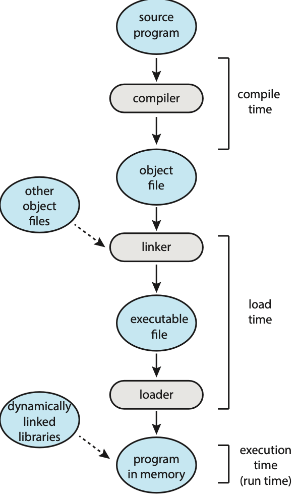
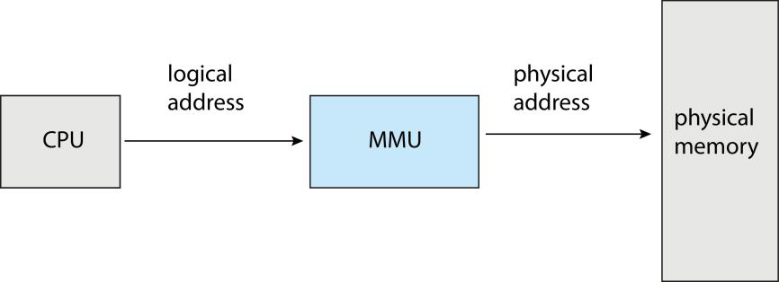
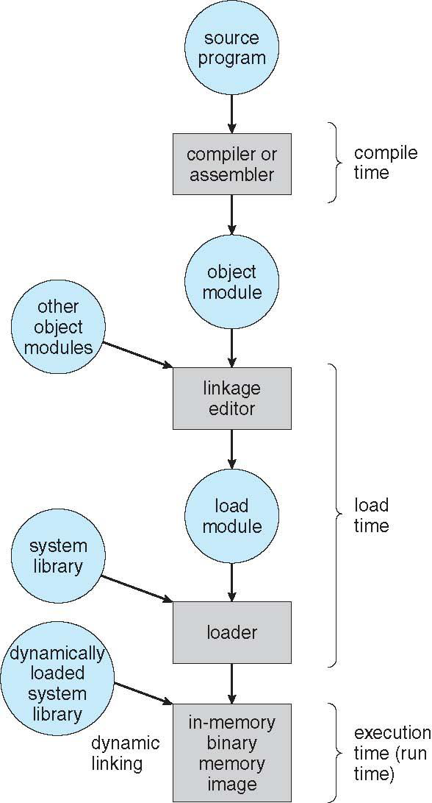
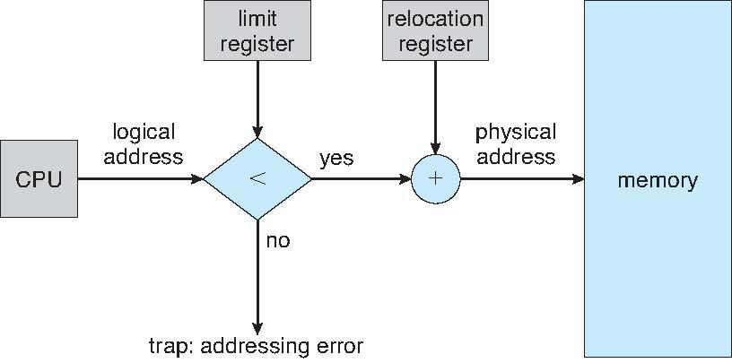
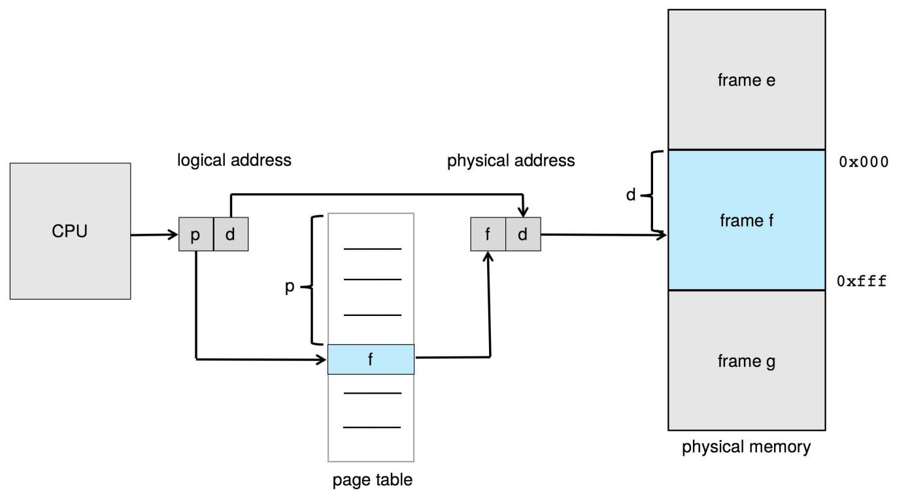
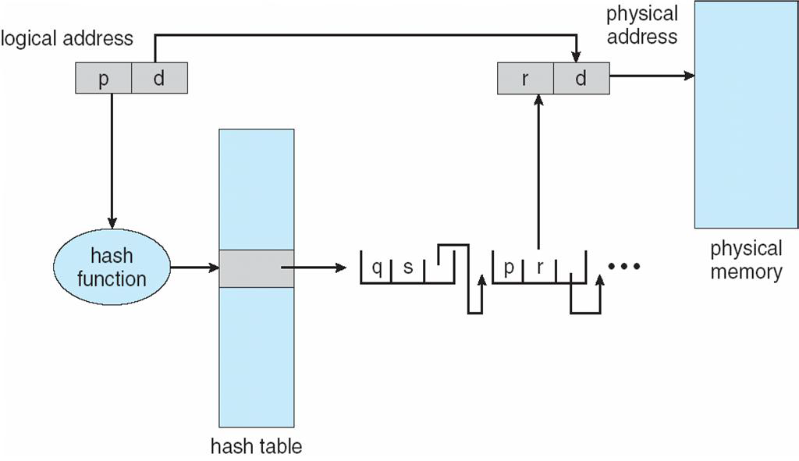
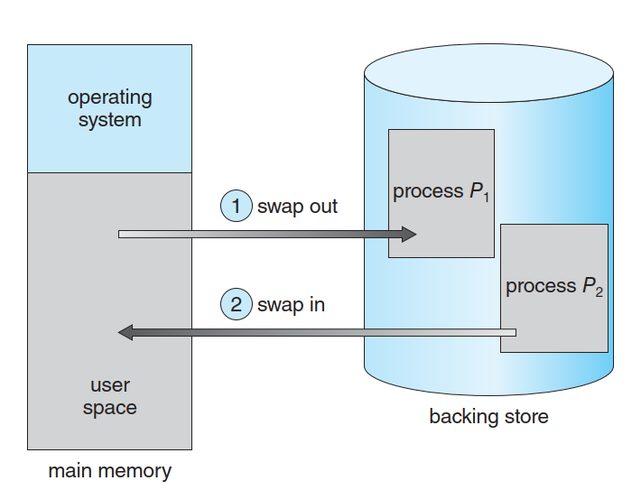
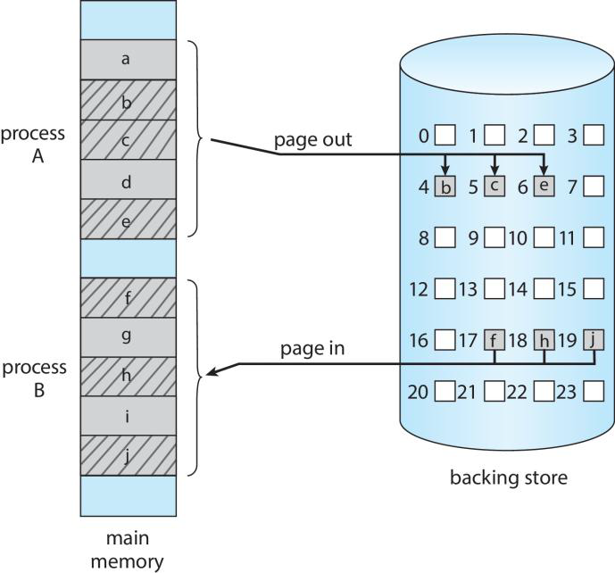

# Memory Management Lecture Notes

## Overview
Memory management is essential because programs must reside in main memory during execution, and multiple processes share this memory simultaneously. The OS needs sophisticated schemes to manage memory efficiently and safely.

## Background & Hardware Fundamentals

### Memory Structure
- Memory is a large array of bytes, each with its own address.
- CPU fetches instructions and data from memory.
- Typical instruction execution involves multiple memory accesses (fetch, decode, load operands, execute, store results).

### Hardware Protection
- CPU can directly access registers (1 clock cycle) and memory (multiple cycles).
- Cache memory helps reduce memory stalls.
- Protection mechanisms prevent unauthorized memory access using:
  - **Base register**: stores smallest allowed address.
  - **Limit register**: stores allowed address range.
  - CPU hardware compares each user-mode address and can trap to OS if violations occur.
  - Loading base/limit registers is a privileged operation.
    - User programs cannot change their own access rights to memory

## Address Binding

Memory addresses can be bound at three different times:

1. **Compile time**: Absolute addresses known beforehand (requires recompilation to change).
2. **Load time**: Relocatable addresses converted to absolute when loading.
3. **Execution time**: Process can be moved during execution (most common in modern OS).



### Logical vs Physical Addresses
- **Logical address**: Generated by the CPU (what the program uses).
- **Physical address**: Actual memory location (what hardware uses).
- **Memory Management Unit (MMU)**: Hardware that translates logical to physical addresses.
- With runtime binding, programs work entirely with logical addresses. It never knows the real physical address.


## Dynamic Loading & Linking

### Dynamic Loading
- Routines **loaded only when called** (not the entire program).
- **Improves memory utilization**, especially for infrequent code paths.
- Does not require special OS support.

```
┌──────────────────────────────────────────────┐
│     Main Program (Loaded in Memory)          │
├──────────────────────────────────────────────┤
│ Call Subroutine (e.g., Error Handler)        │
│                    ↓                         │
│ Check if subroutine is already loaded        │
│                    ↓                         │
│ If NOT loaded:                               │
│ 1. Load from disk to memory                  │
│ 2. Update program address table              │
│ 3. Execute subroutine                        │
└──────────────────────────────────────────────┘
```

**Advantages**:
- **Improved Memory Utilization**: Infrequently used code (e.g., error handling, special features) does not occupy memory.
- **Reduced Startup Time**: The program starts faster because it doesn't need to load all code initially.
- **Flexibility**: Modules can be loaded based on runtime conditions.

**Typical Use Cases**:
- Plugin systems in large software.
- Infrequently used game levels or features.
- Extension modules in professional software.

### Dynamic Linking (DLL - Dynamic Linking and Shared Libraries)
- Linking postponed until runtime.
- System libraries (like libc) shared between all processes.
- Benefits: smaller program files, less memory usage.
- **Requires OS support** to locate and load libraries.
    - When a program needs to use a DLL, the loader locates it (loads to memory if necessary), and adjusts the addresses in the process that reference the DLL.
    - Only the OS can check if the library is in other process memory.

**Static Linking (Traditional)**
```
Program A.exe (Copies libc)     Program B.exe (Copies libc)
          │                               │
          ▼                               ▼
    Process A in Memory             Process B in Memory
  [A Code + libc Copy]            [B Code + libc Copy]
```
*Problem: `libc` exists as two identical copies in memory, wasting space.*

**Dynamic Linking (Modern)**
```
Program A.exe (Ref to libc)     Program B.exe (Ref to libc)
          │                               │
          ▼                               ▼
             Shared libc.dll
                  │
       ┌──────────┴──────────┐
       ▼                     ▼
    Process A in Memory    Process B in Memory
  [A Code + ptr to libc]  [B Code + ptr to libc]
```
*Advantage: Only one copy of `libc` exists in physical memory, shared by all processes.*


**Development Recommendations**:
- Use **Dynamic Linking** for common, stable foundation libraries.
- Use **Dynamic Loading** for optional, large, or infrequently used features.

## Contiguous Memory Allocation

### Basic Concept
- Each process occupies a single contiguous memory section.
- Memory divided into **OS memory and user memory**.
- Protection via limit register.


### Allocation Strategies
- When a process arrives, the OS finds a hole large enough.
- The unused part of the hole returns to the set of holes.
- When a process terminates, its block creates a new hole, that may be merged if there are adjacent holes.
- When finding a hole for a process:
    - **First fit**: Use first hole big enough (fastest).
    - **Best fit**: Use smallest sufficient hole (minimizes leftover).
    - **Worst fit**: Use largest hole.

### Fragmentation Problems

**External Fragmentation**
- Enough total memory exists but not contiguous.
- Solutions:
  - **Compaction**: Place all free memory together (requires runtime relocation).
  - **Paging**: Allow non-contiguous logical address space.

**Compaction**
```
Before Compaction:
┌───┐ ┌───┐ ┌───┐ ┌───┐
│ A │ │Free│ │ B │ │Free│
└───┘ └───┘ └───┘ └───┘

After Compaction:
┌───┐ ┌───┐ ┌───┐ ┌───┐
│ A │ │ B │ │Free│ │Free│
└───┘ └───┘ └───┘ └───┘
(All free space merged into one block)
```
- **Principle**: Move processes in memory to merge all free space into one contiguous block.
- **Requirements**:
  - **Runtime Relocation Support**: Processes must be movable in memory.
  - **Relocation Register Update**: OS must update the base register for each process.
  - **Execution Pause**: All processes must be paused during compaction (high cost).
- **Pros & Cons**:
  - ✅ Completely solves external fragmentation.
  - ❌ High performance overhead (moving memory data).
  - ❌ Requires complex hardware support.

**Internal Fragmentation**
- Allocated memory slightly larger than requested.
- Occurs when using fixed-size blocks.

## Paging

### Core Concept
Paging eliminates external fragmentation by allowing non-contiguous physical memory allocation.

### Basic Method
- **Physical memory**: divided into fixed-size **frames** (power of 2).
- **Logical memory**: divided into **pages** (same size as frames).
- Pages loaded into any available frames.

### Address Translation
Logical addresses have two components:
- **Page number (p)**: index into page table.
- **Page offset (d)**: location within the frame.
  - The page offset is the part of the logical address used to locate the specific byte within a page. It tells the CPU/MMU: "Where exactly in this page is the data?"

**Example Calculation**:
```
Assumptions:
- Page Size = 4KB = 4096 bytes = 2^12 bytes
- Logical Address = 0x12345678 (32-bit address)

Breakdown:
Binary: 0001 0010 0011 0100 0101 0110 0111 1000
Split into two parts:
┌──────────────────────────────┬──────────────────────────────┐
│    Page Number (High 20 bits)  │   Page Offset (Low 12 bits)  │
│    0001 0010 0011 0100 0101    │   0110 0111 1000             │
│    0x12345 (Dec: 74565)        │   0x678 (Dec: 1656)          │
└──────────────────────────────┴──────────────────────────────┘

Translation Steps:
1. CPU provides Logical Address: 0x12345678
2. Hardware splits: p = 0x12345, d = 0x678
3. Lookup Page Table: Page 0x12345 -> Frame 0xABCDE
4. Synthesize Physical Address: (0xABCDE << 12) | 0x678 = 0xABCDE678

Explanation:
- 0xABCDE000 is the start address of the frame (shifted left by 12 bits).
- 0x678 is the offset from the start of the frame.
- Final Physical Address = Frame Start + Page Offset.
```

**Exercise**:
```
Given:
- Page Size: 8KB = 2^13 bytes
- Logical Address: 0x3A7F9B
- Physical Frame Number: 0x123

Find: Physical Address?

Steps:
1. Page size is 8KB, so Offset (d) needs 13 bits.
2. Logical Address 0x3A7F9B
3. Split: Page Number = High bits, Offset = Low 13 bits.
   0x3A7F9B -> Binary ...11 1010 0111 1111 1001 1011
   Offset (Low 13 bits) = 1 1111 1001 1011 = 0x1F9B
   (Or simply 0x3A7F9B & 0x1FFF = 0x1F9B)
4. Physical Address = (Frame Number << 13) | Offset
   (0x123 << 13) | 0x1F9B 
   = 0x246000 | 0x1F9B 
   = 0x247F9B
```
**The OS manages the physical memory.**

It keeps:
- **Frame table**: keep track of frames allocated and frames available
    - One entry for each physical frame
- **A copy of the page table for each process**:
    - Used in system calls of user processes may provide an address as a parameter (Ex. a buffer location)
    - Used by the dispatcher during context switches to define the active page table.

**Translation Process**:
1. Extract page number `p`.
2. Look up frame number `f` in page table at index `p`.
3. Access offset `d` in frame `f`.


### Page Table Implementation
The PCB keeps a pointer to the process’ page table.

**Option 1: Hardware Registers**
- Very fast translation.
- Slow context switches (all registers must be updated).

**Option 2: Memory-Based(Page table kept in main memory)**
- Uses **Page Table Base Register (PTBR)** pointing to table in memory.
- Fast context switches (only update PTBR).
- Slower memory access (extra memory reference needed).
    - Try to mitigate it with some fast look-up hardware: the translation look-aside buffer (TLB)

**Page Table Entry (PTE) Structure**
```
Typical PTE (32-bit system):
┌─────┬──────┬─────┬──────┬──────┬───────┐
│Valid│Protect│Dirty│Access│Cache │ Frame # │
├─────┼──────┼─────┼──────┼──────┼───────┤
│1 bit│2 bits│1 bit│1 bit │1 bit │20 bits│
└─────┴──────┴─────┴──────┴──────┴───────┘

Field Descriptions:
1. Valid (V): 1=Page in memory, 0=Page not in memory (triggers Page Fault).
2. Protection (RWX): Read/Write/Execute permissions.
3. Dirty (D): Modified bit (determines if page needs writing back to disk).
4. Access (A): Referenced bit (used for page replacement algorithms).
5. Cache (C): Cache disable bit.
6. Frame #: Physical frame number (20 bits for 1M frames).
```

**PTBR Implementation Details**
- Each process has its own page table stored in memory.
- When Process A runs: PTBR -> Process A's Page Table.
- When Process B runs: PTBR -> Process B's Page Table (updated on context switch).
- **Problem**: Every address translation requires accessing the Page Table in memory first.
  - Requires 2 memory accesses (1 for Page Table + 1 for Data).
  - Performance is halved!

## Translation Lookaside Buffer (TLB)

### Purpose
Fast cache for page table entries to mitigate memory access slowdown.

### Characteristics
- Associative high-speed memory.
- Contains key-value pairs:
  - **Key**: ASID (Process ID) + page number.
  - **Value**: frame number.
- Simultaneous comparison of all keys.
- Typical size: 32-1024 entries.
- Uses LRU or random replacement policies.

```
TLB = High-speed cache for Page Table (inside MMU)

TLB Entry Structure:
┌──────┬─────────────┬──────────────┬────────────┐
│ ASID │ Page Number │ Frame Number │ Protection │
└──────┴─────────────┴──────────────┴────────────┘
 (Optional)

Workflow:
1. CPU generates Logical Address (p, d).
2. MMU checks TLB in parallel (Hardware comparison).
3. If TLB Hit (p found):
   → Directly generate Physical Address (f, d).
4. If TLB Miss:
   → Access Page Table in memory to get frame number.
   → Update TLB (may replace old entry).
```

**TLB Management Strategies**:
- **Replacement Algorithms** (when TLB is full):
  1. **LRU (Least Recently Used)**: Tracks usage time.
  2. **Random**: Simple and effective.
  3. **FIFO (First-In, First-Out)**: May replace frequently used entries.
- **Special Handling**:
  - **Wired Entries**: Critical OS code pages are fixed in TLB.
  - **TLB Flush**: On context switch, clear TLB or use ASID to distinguish processes.

### Effective Access Time (EAT)
Formula: `EAT = R × Memory_time + (1-R) × (2 × Memory_time)`

Where R is the hit ratio:
- R = 80% → EAT = 12ns (with 10ns memory access).
- R = 99% → EAT = 10.1ns.

## Page Table Protection

### Protection Bits
Each page table entry contains:
- **Read/write bit**: defines page permissions.
- **Valid/invalid bit**: indicates if page is in process's logical address space.
- Violations trigger traps to the OS.

### Shared Pages
- Facilitates sharing of common code (like libc) or data between processes.
- Code must be **reentrant** (non-self-modifying).
- Enforced as read-only by OS.
- Single physical copy mapped by multiple page tables.

```
Scenario: Multiple processes running the same program (e.g., bash)

Physical Memory:
┌─────────────────┐
│  bash code page │ ← Read-Only, Shared
│  (Frame 0x1000) │
└─────────────────┘

Process A Page Table:
Page 0 → Frame 0x1000 (Code Page)
Page 1 → Frame 0x2000 (A's Private Data)

Process B Page Table:
Page 0 → Frame 0x1000 (Shared Code Page)
Page 1 → Frame 0x3000 (B's Private Data)

Advantage: Saves memory, faster program startup.

Shared Memory (IPC) Scenario:
1. Process A requests shared memory (e.g., shm_open).
2. OS allocates Physical Frame (e.g., Frame 0x4000).
3. OS maps it to both Process A and Process B page tables:
   Process A: Virtual Page X → Frame 0x4000
   Process B: Virtual Page Y → Frame 0x4000
4. Both processes can read/write the same physical memory via their virtual addresses.
```

## Page Table Structures

### Hierarchy Issues
For a 32-bit system with 4KB pages:
- Address space: 2^32 = 4GB.
- Page size: 2^12 = 4KB.
- Number of pages: 1 million.
- Page Table size: 1M entries * 4 bytes/entry = 4MB.
- **Problem**:
  1. Requires 4MB contiguous memory per process.
  2. 100 processes = 400MB just for page tables.
  3. Most processes use only a small fraction of address space.

### Hierarchical Paging
- Divides large page tables into smaller pieces.
- Example: 2-level paging for 32-bit addresses with 4KB pages = 1MB entries.
- **Problem**: 64-bit addresses would require too many levels (7+ levels) -> too many memory accesses.

**Two-Level Paging Implementation**
```
32-bit System, 4KB Page, 2-Level Page Table:

Logical Address Split:
┌─────10 bits─────┬─────10 bits─────┬──────12 bits──────┐
│  p1 (Outer)     │   p2 (Inner)    │    Offset (d)     │
└─────────────────┴─────────────────┴───────────────────┘

- p1: Index into Page Directory (Outer Page Table)
- p2: Index into Inner Page Table
- d:  Page Offset

Memory Layout:
┌─────────────────────┐
│ Page Directory (4KB)│ ← 1024 Entries
│ p1=0 → Page Table A │
│ p1=1 → Page Table B │
│ ...                 │
│ p1=1023 → NULL      │
└─────────────────────┘
         ↓ (If present)
┌─────────────────────┐
│ Inner Page Table    │ ← 1024 Entries
│ p2=0 → Frame X      │
│ p2=1 → Frame Y      │
│ ...                 │
└─────────────────────┘
         ↓ (If present)
┌─────────────────────┐
│ Actual Data Page    │
│ [User Data]         │
└─────────────────────┘
```

**Access Logic**:
1. Get Page Directory Physical Address from CR3 Register.
2. Use `p1` to index Page Directory.
   - If entry missing → Page Fault (Page Table not in memory).
3. Get Inner Page Table Physical Address.
4. Use `p2` to index Inner Page Table.
   - If entry missing → Page Fault (Data Page not in memory).
5. Get Data Page Physical Frame.
6. Synthesize Address: `(Frame << 12) | d`.

*Requires 3 memory accesses (Directory -> Table -> Data), unless cached by TLB.*

**Pros & Cons**:
- ✅ **Saves Space**: Only allocate Page Tables for used address space.
- ✅ **Easy Management**: Can page in/out parts of the page table.
- ❌ **Latency**: Each level adds a memory access.
- ❌ **Complexity**: Hardware/OS logic is more complex.

### Hashed Page Tables
- Better for super large logical address spaces (e.g., > 64-bit).
- Hash function on page number determines index.
- Collisions handled with linked lists.

**Workflow**:
```
Access Virtual Address (vpn, offset):

1. Calculate Hash: h = hash(vpn)
2. Index Bucket: bucket = hash_table->buckets[h & mask]
3. Traverse Linked List to find matching VPN:
   while (entry != NULL) {
       if (entry->vpn == vpn && entry->pid == current_pid) {
           // Match found
           frame = entry->frame_num;
           break;
       }
       entry = entry->next;
   }
4. If Found: Physical Address = (frame << offset_bits) | offset
5. If Not Found: Page Fault
```


## Swapping

### Purpose
Allow total logical address space to exceed physical memory by temporarily moving processes/pages to disk.

### Standard Swapping
- Moves entire processes to backing store.
- Increases degree of multiprogramming.
- Time-prohibitive for large processes.


### Swapping with Paging
- **Page out**: move single page from memory to backing store.
- **Page in**: restore page from backing store to memory.
- More efficient than swapping entire processes.
- Enables modern virtual memory systems.


## Key Takeaways

1. Memory management balances efficiency, protection, and flexibility.
2. Paging is the dominant modern approach, eliminating external fragmentation.
3. TLB is critical for performance in paging systems.
4. Hardware and OS must cooperate closely for effective memory management.
5. Swapping enables virtual memory larger than physical memory.

## Important Commands/System Calls
- `getpagesize()` - get system page size.
- `getconf PAGESIZE` - command line to check page size.