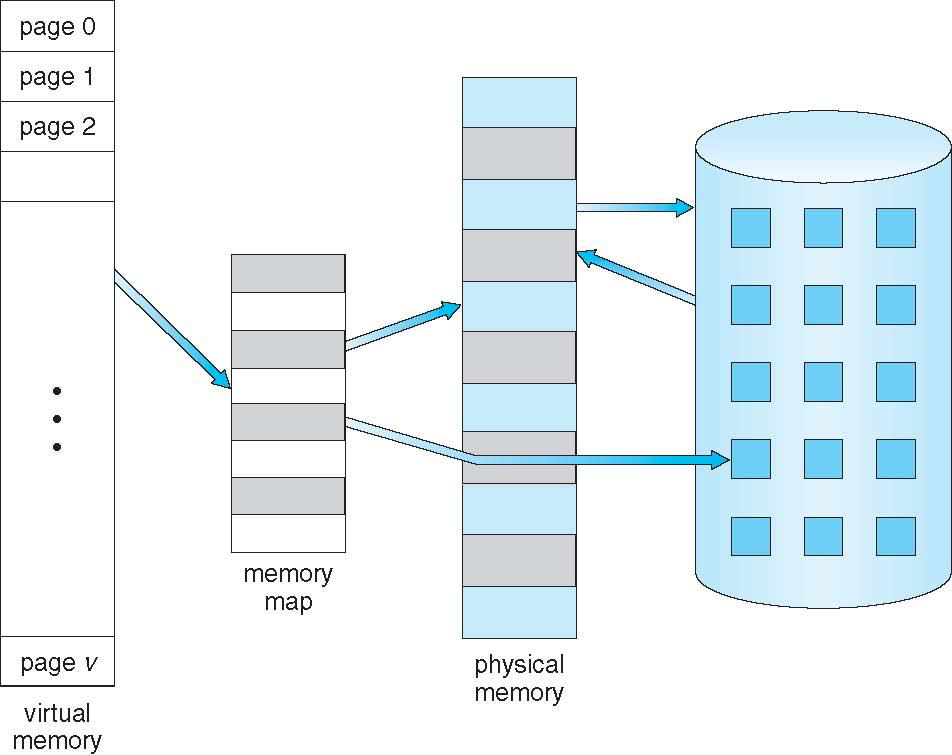
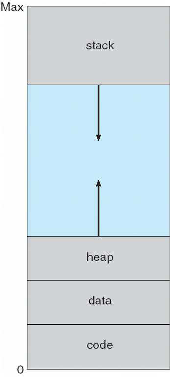
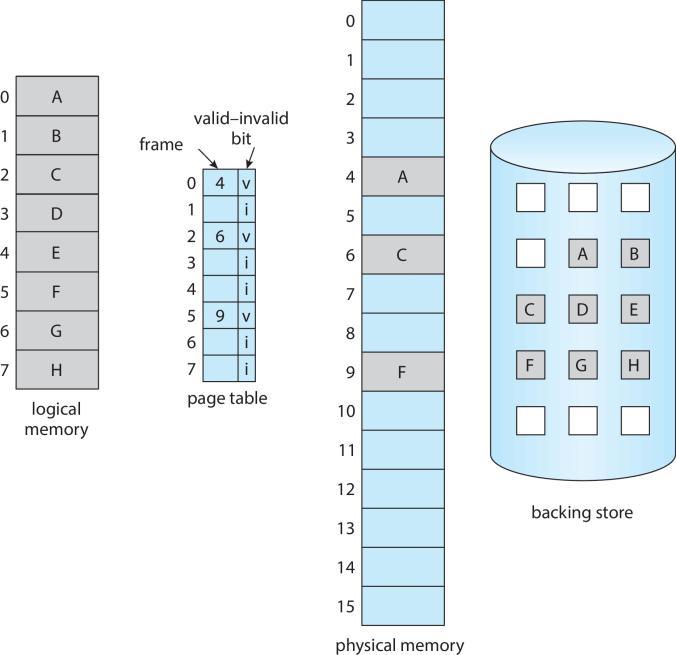
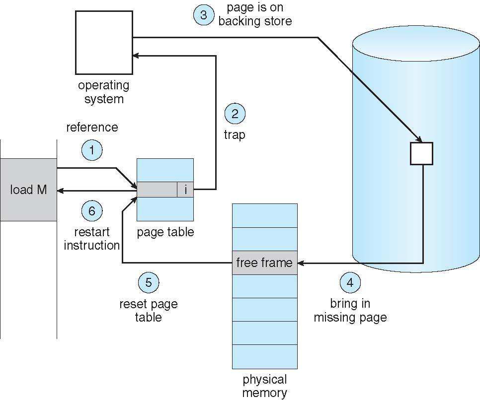
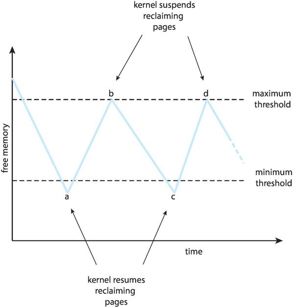
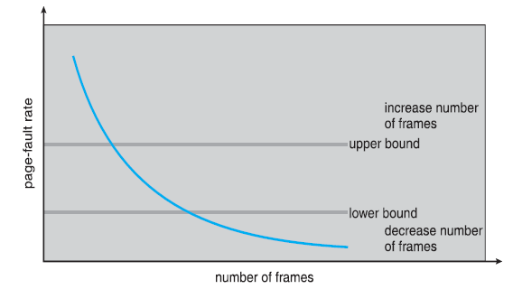

# Virtual Memory

## Overview
Virtual memory enables executing processes that are not completely in physical memory, building on the swapping with paging concept introduced in the previous lecture.


## Virtual Memory Benefits

### Key Advantages
1. **Programs are allowed to be larger than the physical memory** - no longer constrained by RAM limits
2. **Reduced I/O load** - only necessary pages loaded
3. **Higher multiprogramming degree** - each program requires less physical memory
4. **Reduced swap I/O** - less memory pressure overall
5. **Increased CPU utilization** - more processes can run simultaneously without affecting response time

#### **Why Swapping is inefficient?**
- **Large data transfer**: Requires moving the entire process (possibly tens of MB to several GB)
- **Long process blocking time**: The process is completely unable to execute during swap-in/swap-out
- **Disk I/O bottleneck**: Frequent swapping causes disk congestion

#### **why Virtual memory Increased CPU utilization and throughput?**
- **CPU utilization**: More processes in ready state → CPU idle time decreases
- **Throughput**: More work completed per unit time
- **Response time**: Fast feedback time for interactive systems
- **Turnaround time**: Total completion time for batch jobs

Virtual memory improves all these metrics by reducing I/O wait times

#### **Comparison Table**
| Metric | Definition | Unit | Optimization Goal | Relationship with Virtual Memory |
|--------|------------|------|-------------------|----------------------------------|
| **Swapping** | Entire process memory ↔ disk | Process/operation | Reduce frequency | Virtual memory replaces most swapping with paging |
| **Throughput** | Work completed per unit time | Work/time | Maximize | Virtual memory increases multiprogramming degree → higher throughput |
| **Turnaround Time** | Total time from submission to completion | Time units | Minimize | Virtual memory reduces load delays → potentially decreases turnaround time |


### When Entire Programs Aren't Needed
Much program code handles errors, exceptions, or unusual conditions that are rarely executed. Virtual memory allows keeping only the actively used portions in memory.



## Virtual Address Space

### Concept
The logical view of how a process is stored in memory, typically:
- Begins at address 0
- Appears as contiguous memory
- Heap grows upward
- Stack grows downward
- **Hole between heap and stack** is part of virtual address space but only gets physical frames when heap/stack grows

### Sparse Address Spaces
Virtual address spaces with holes enable:
- Filling holes with heap/stack growth
- Dynamic library linking
- File and memory sharing (system libraries, IPC, faster fork())




## Demand Paging

### Basic Concept
Load pages into memory **only as they are needed**, not all at once.

### Valid/Invalid Bit
Used in page table to track page status:
- **Valid**: page is in memory and legal
- **Invalid**: either
  1. Not a valid page → illegal access → segmentation fault
  2. Valid page but not in memory → trigger page fault to load it

### Page Fault
Access a page marked invalid.
- Trap to the OS


### Page Fault Handling Process

When accessing an invalid page:

**I. Validate the reference**
- If invalid → terminate process

**II. Bring page to memory** (if valid but not loaded)
1. Find a free frame from free frame list
2. Send I/O request to read page from secondary storage (swap space)
3. When I/O completes, update page table to mark page as valid

**III. Restart the interrupted instruction**
- Must restart from instruction fetch using program counter
- Instruction may cause multiple page faults (instruction fetch + data operands)



### Hardware Requirements
- **Page table** with valid/invalid marking
- **Secondary memory (swap space)** to hold pages not in main memory
- **Ability to restart instructions** in the same state from fetching it, using the program counter

### Challenging Example
```
Operation: ADD A, B, C
Steps: Fetch instruction → Fetch A → Fetch B → Calculate → Store C
Potential: 4 page faults if only 3 pages fit in memory
Problem: Full restart needed when bringing page for C
```


## Free Frame Management

### Free Frame List
- Pool of free frames used to resolve page faults
- Initially contains all memory at system startup
- Must be repopulated when empty or below threshold

### Zero-Fill-On-Demand
Erase pages with zeros before allocation for security purposes.


## Performance Analysis

### Effective Access Time (EAT) Formula
```
EAT = (1-p) × ma + p × page_fault_time
```
Where:
- **p** = probability of page fault (0 to 1)
- **ma** = memory access time (typically 200ns)
- **page_fault_time** ≈ 8ms (including I/O)

### Performance Example
Given ma = 200ns and page_fault_time = 8ms:

```
EAT = 200 + p × 7,999,800 nanoseconds
```

**Scenarios:**
- **p = 1/1000**: EAT = 8,200ns (40× slower!)
- **For <10% degradation** (EAT ≤ 220ns): p must be < 0.0000025
  - Less than 1 page fault per 400,000 memory accesses

### Page Fault Service Time Breakdown
1. Trap to OS
2. Save registers and process state
3. Determine interrupt was page fault
4. Validate reference and locate in storage
5. **Send I/O read** (major time cost: ~8ms)
   - Wait for request servicing
   - CPU allocated to other processes during wait
6. Receive I/O completion interrupt
7. Save current process state
8. Determine interrupt source
9. Update page table
10. Wait for CPU allocation
11. Restore registers and restart instruction


---

## Page Replacement

### The Problem
With high multiprogramming, memory becomes over-allocated. When all frames are in use and a page fault occurs, what should the OS do?

**Options:**
1. ❌ Terminate process (bad UX)
2. ❌ Swap entire process (high overhead)
3. ✅ **Page replacement** (swap individual pages)

### Basic Page Replacement Algorithm

**Steps:**
1. Find location of desired page on secondary storage
2. Find a free frame:
   - If free frames available → use them
   - Otherwise → select victim frame via replacement algorithm
     - Write victim to secondary storage
     - Update page/frame tables
3. Read desired page into free frame
   - Update page/frame tables
4. Continue process execution

### Dirty Bit Optimization
- Tracks whether page was modified
- **If not modified**: no need to write back (already on disk) → just discard
- **If modified**: must write to storage before replacing
- Reduces overhead from 2 transfers to 1 when possible

---

## Page Replacement Algorithms
- Page replacement completes the separation between logical and physical memory
    - An enormous virtual memory can be provided to programmers on a smaller physical memory.
- Two major problems to solve to implement demand pages
  - Frame-allocation algorithm: decide how many frames are allocated to each process
  - Page-replacement algorithm: select the frames that are to be replaced (victims)
  - I/O is time-consuming. Even a slight improvement in these algorithms yields large gains in system performance

### 1. FIFO (First-In-First-Out)

**Method:** Replace page that has been in memory longest

**Implementation:**
- FIFO queue holding all pages
- Replace head of queue
- New pages added to tail

- **Problem:** Poor performance, suffers from **Belady's Anomaly**
  - More frames can sometimes cause MORE page faults!


### 2. Optimal Page Replacement

**Method:** Replace page that won't be used for longest period
- **Guarantee:** Lowest page fault rate possible

**Problem:** Cannot be implemented in practice
- Requires future knowledge of reference string
- Similar to SJF scheduling impossibility
- Used as theoretical benchmark

---

### 3. LRU (Least Recently Used)

**Method:** Replace page unused for longest period (approximates optimal using past as predictor of future)

**Implementation Challenges:**
Needs hardware assistance:

**Counter Method:**
- Logical clock ticks on each memory access
- Each page table entry has time-of-use field
- Search page table for smallest value (LRU)

**Stack/List Method:**
- On each page access: remove from list, put on top
- Bottom of stack = LRU page
- More expensive updates but no search needed for replacement

---

### 4. LRU-Approximation Algorithms

Used when full LRU hardware support unavailable.

#### Reference Bit
- Hardware sets reference bit when page accessed
- Know which pages NOT accessed
- Don't know order among accessed pages

#### Additional-Reference-Bits Algorithm
- Use 8 reference bits per page
- Periodically (timer), OS shifts reference bit to high order
- Read as unsigned integer; lowest value = LRU page
- Handle ties with FIFO

#### Second-Chance Algorithm (Clock Algorithm)
- FIFO replacement with reference bit check
- **If head has ref bit = 0** → victim, replace it
- **If head has ref bit = 1** → set to 0, move to tail (second chance)
- View queue as circular array (clock hand)
- **Worst case:** All bits = 1, pointer cycles through entire queue

#### Enhanced Second-Chance Algorithm
Uses reference bit AND modify bit as pair `<ref, mod>`:
- **<0,0>**: Best to replace (not recently used, not modified)
- **<0,1>**: Not recently used but modified (requires I/O)
- **<1,0>**: Recently used but clean (may be needed soon)
- **<1,1>**: Recently used and modified (worst choice, needs I/O)


### 5. Counting-Based Algorithms

**Least Frequently Used (LFU):**
- Replace page with smallest access count
- Problem: initialization pages may have high count but not be used

**Most Frequently Used (MFU):**
- Replace page with highest count
- Logic: small count = recently brought in, probably still needed

**Reality:** Expensive to implement, not commonly used


### 6. Page-Buffering Algorithms

Optimization strategies:
1. **Keep pool of free frames** - page fault gets frame immediately from pool, victim written out later
2. **Keep list of modified pages** - write them out during idle time so they're clean if selected as victims
3. **Remember which page was in freed frames** - if needed again before reallocation, can reuse from pool


## Frame Allocation

### Minimum Number of Frames
- Fewer frames → more page faults
- Must have enough frames for all pages a single instruction can reference
  - Example: `MOV [A], AX` requires 3 frames minimum

### Allocation Algorithms

#### Equal Allocation
- Give all processes equal share: m frames ÷ n processes
- **Problem:** Ignores different memory needs of processes

#### Proportional Allocation
- Allocate according to process size
- Formula: `a_i = (s_i / Σs_i) × m` (m frames for n processes)
  - Where s_i = size of process i
  - Adjust to integer ≥ minimum required frames

## Global vs Local Allocation

### Local Replacement
- Process selects replacement only from its own allocated frames
- Number of frames per process stays constant
- May keep less-used pages while other processes need frames more

### Global Replacement
- Can select victim from ANY frame, even from other processes
- Allows high-priority processes to take frames from low-priority ones
- Generally results in **greater system throughput**
- **Problem:** Performance variability - a process's memory depends on others' behavior

### Improvement: Threshold-Based Replacement
- Trigger replacement when free-frame list falls below threshold
- Don't wait until list is empty
- **Reapers:** kernel routines that reclaim pages



**If reaper can't maintain enough free frames:**
- Reclaim more aggressively: suspend second-chance, use FIFO
- Use **OOM (Out-Of-Memory) killer** to terminate processes
- Check `/proc/pid/oom_score` for termination likelihood

## Thrashing

### Definition
When a process spends more time paging than executing.

### The Downward Spiral

1. CPU utilization low → increase multiprogramming degree
2. New process needs frames → takes from old processes
3. Old process needs those frames → page faults
4. Victims also needed by other processes → more page faults
5. I/O queue for paging grows → less useful work
6. CPU scheduler sees low utilization → adds MORE processes
7. **Result:** System spends all time paging, no work done ⚠️

### Solutions

#### 1. Local Replacement Algorithm
- Limits effects (process only affects its own pages)
- Doesn't fully solve the problem

#### 2. Locality Model
- **Locality:** Set of pages actively used together
- Process moves from locality to locality during execution
- **Key insight:** Provide enough frames for current locality size
- **If insufficient frames for locality → thrashing occurs**


#### 3. Page-Fault Frequency (PFF)
- Monitor page-fault rate of each process
- **If too high:** increase allocated frames
- **If too low:** reduce allocated frames
- Establish upper and lower bounds
- **If high rate AND no free frames:** swap out a process, redistribute frames



## Program Structure Impact

### Array Access Pattern Example

```c
int data[128][128];  // Each row stored in one page
```

**Program 1** (column-major):
```c
for (j = 0; j < 128; j++)
    for (i = 0; i < 128; i++)
        data[i][j] = 0;
```
**Result:** 128 × 128 = **16,384 page faults**

**Program 2** (row-major):
```c
for (i = 0; i < 128; i++)
    for (j = 0; j < 128; j++)
        data[i][j] = 0;
```
**Result:** **128 page faults**

**Lesson:** Access patterns matter! Row-major access is 128× more efficient.

## Key Takeaways

1. **Virtual memory enables programs larger than physical RAM** through demand paging
2. **Page faults are expensive** (8ms vs 200ns) - must keep rate extremely low
3. **Page replacement algorithms trade implementation cost for performance**:
   - Optimal is impossible but provides benchmark
   - LRU is effective but expensive
   - Second-chance/Clock is practical compromise
4. **Thrashing is catastrophic** - prevention through proper frame allocation is critical
5. **Global replacement generally outperforms local** but requires careful management
6. **Program structure affects paging performance** - locality matters

